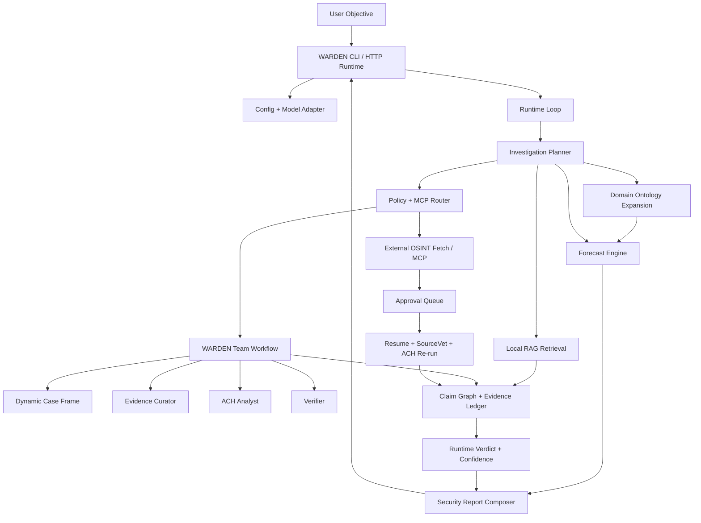

# WARDEN Agents

> 편향 덩어리인 LLM에게서 **판단 권한을 뺏어** 검증 가능한 코드와 사람에게 둔, 통제형(controlled) 멀티 에이전트 분석 하네스.
> 안보·지정학·공급망·미래예측 질문을 받아, LLM은 **제안(proposal)만** 하고 실제 판단·외부 호출·승인은 결정적 코드와 운영자가 통제합니다.

WARDEN은 자연어 objective를 받아 분석계획 → 도메인 온톨로지 확장 → 로컬 RAG → ACH(경쟁가설분석) → SourceVet(출처 검증) → forecast → 보안분석 보고서까지를 하나의 통제된 런타임 루프로 엮습니다. 모델 출력은 절대 실행 권한을 갖지 않으며, policy review·approval queue·deterministic ACH·SourceVet·verifier·audit trace가 권위 계층을 형성합니다.

기본 실행 경로는 **offline-first**입니다. 기본 demo와 `npm test`는 live LLM, live MCP, 외부 네트워크 호출을 요구하지 않습니다.

이 프로젝트의 전신은 ACH·SourceVet 규율을 MCP로 강제한 프로토타입(`02018_ach_mcp`)이며, WARDEN은 이를 모듈로 흡수해 실런타임 제품으로 확장한 본편입니다. 설계·개발 이력 전체는 [`docs/notes/`](docs/notes/INDEX.md)에 보존되어 있습니다.

## 핵심 설계 원칙

1. **LLM은 proposal 역할만 한다.** 모델 응답은 planner/answer 제안으로만 저장되고, 어떤 도구도 모델이 직접 실행하지 못한다.
2. **권위는 코드와 사람에게 있다.** policy engine, approval queue, MCP router, ACH, SourceVet, verifier가 최종 판단을 내린다.
3. **외부 호출은 사람 승인 전까지 차단한다.** `EXTERNAL` risk 액션은 무조건 approval pending으로 남는다.
4. **판단은 최다 지지가 아니라 최소 모순으로 정한다.** ACH는 확증편향을 구조적으로 차단한다.
5. **사실·추론·예측·불확실성·수집 공백을 분리해 보고한다.** 근거가 부족하면 단정하지 않고 정확히 멈춘다.

## 아키텍처



### 통제 계층 (control boundary)

| 계층 | 책임 | 권위 |
|---|---|---|
| Model Adapter | planner/answer 제안 생성 (mock / codex / openai-compatible / local) | 제안만 |
| Policy Engine | risk 분류, egress 승인 강제 (`EXTERNAL` → require_approval) | 차단/허용 |
| Approval Queue | 외부 호출에 대한 사람 승인(y/n) | 사람 |
| MCP Router | capability → tool 라우팅, allowlist/schema 검증 | 실행 게이트 |
| ACH Engine | 경쟁가설 최소 모순 판정 (결정적) | 분석 판단 |
| SourceVet | 출처 신뢰도·날조위험·순환출처 검증 (결정적) | 증거 승격 |
| Verifier / Audit | 검증·trace·해시체인 감사 로그 | 기록·검증 |

### 실행 흐름

1. 사용자가 `warden` 또는 `warden run "<objective>"`로 질문한다.
2. `src/runtime/loop.ts`가 run을 만들고 상태를 `queued → running`으로 전환한다.
3. model provider(mock/codex/openai-compatible)가 설정된다.
4. `buildInvestigationPlan()`이 질문별 분석계획(도메인·시나리오·가설·검색계획)을 만든다.
5. `buildRuntimeAnalysisProducts()`가 도메인 확장, RAG, claim graph, forecast 산출물을 만든다.
6. runtime planner가 다음 tool plan을 선택한다.
7. policy/MCP router가 `run_warden_team` 또는 `external_osint_fetch`를 **통제 실행**한다.
8. 팀 실행 결과로 dynamic case frame, evidence bundle, ACH 결과가 생성된다.
9. 외부 OSINT는 승인 대기로 남고, 승인 시 SourceVet 검토 → 관련도 게이트 → ACH 재실행한다.
10. `deriveRuntimeVerdict()`·`composeSecurityReport()`가 결론(판정 수준·신뢰도·다음 행동)과 보안분석 보고서를 만든다.

### 결론(Verdict) 5단계

ACH의 "생존 가설"을 사용자 결론으로 그대로 노출하지 않고, 별도 verdict 상태기계로 분리합니다.

| 상태 | 의미 |
|---|---|
| `blocked` | 외부 수집 승인 전이라 결론 불가 |
| `insufficient_evidence` | 직접 근거 부족 → 판정 보류 |
| `provisional` | 잠정 판단(추가 근거 필요) |
| `supported` | 현재 판단 성립 |
| `strong` | 높은 신뢰도 판단(독립 근거·공식 출처·forecast confidence 충족) |

### 소스 구조 (모듈 맵)

`src/` 기준 약 25.5K LOC / 142 TS 파일.

| 경로 | 책임 |
|---|---|
| `src/runtime/` | 런타임 루프, 투자계획 planner, answer/verdict, confidence, resume, MCP 경계 검증, 한국어 포맷 |
| `src/cli/` | `warden` CLI 콘솔(단계 패널·승인 UX·렌더 계약) |
| `src/agent/` | 팀 러너, ACH/SourceVet 로컬 도구, claim-graph, models, report, security, storage |
| `src/connectors/osint/` | search, discovery, html-scraper, article-extractor, source-registry, robots/sitemap |
| `src/connectors/rag/` | 로컬 corpus, BM25형 retrieval |
| `src/domain/` | 안보 온톨로지, 시나리오 라이브러리, query expansion |
| `src/forecast/` | base rate·indicator scoring·확률범위·시나리오·watchlist |
| `src/mcp/` | ACH / forecast / osint / rag stdio MCP 서버 |

## Requirements

- Node.js `>=22.14.0`
- npm

## Quick Start

```bash
npm install
npm run build
npm run cli
```

`npm run cli`는 로컬 개발용으로 `warden` CLI를 실행합니다. 패키지를 링크하면 터미널에서 바로 `warden` 명령을 쓸 수 있습니다.

```bash
npm link
warden
```

대화형 모드에서는 objective를 입력하고 enter를 누르면 runtime loop가 실행됩니다. 외부 호출이 필요하면 승인 전까지 차단되고 `예(y) / 아니오(n)`로 묻습니다.

한 번만 실행:

```bash
warden run "중국의 대만 침공 가능성"
```

모델 보조 답변 초안 포함 / 기계가 읽을 JSON 출력:

```bash
warden run "대한민국 및 동북아 공급망에 대해 알려줘" --answer-mode assisted
warden run "대한민국 및 동북아 공급망에 대해 알려줘" --json
```

`y`, `yes`, `예`, `네`는 승인 후 즉시 resume, `n`, `no`, `아니오`, 엔터는 거부입니다. 자동화 환경에서는 승인 대기 상태를 출력한 뒤 종료하며, `--no-approval-prompt`로 질문을 끌 수 있습니다.

## Main Commands

| Command | Purpose |
|---|---|
| `npm run cli` | local `warden` CLI 실행 |
| `warden run "<objective>"` | objective 1회 실행 |
| `warden run "<objective>" --answer-mode assisted` | 모델 보조 답변 초안 포함 |
| `warden run "<objective>" --json` | answer object 포함 JSON 출력 |
| `warden server` / `npm start` | HTTP runtime server 실행 |
| `npm run build` | import/build sanity check |
| `npm test` | build + 전체 regression 검증 |

대화형 CLI 명령: `/runs` · `/approve [id|tool]` · `/reject [id|tool]` · `/next` · `/rerun` · `/details` · `/server` · `/help` · `/exit`.

회귀 스크립트는 `package.json`의 `demo:warden:*` 약 40종으로 제공됩니다 (예: `demo:warden:runtime-verdict`, `demo:warden:source-relevance`, `demo:warden:live-osint-guard`, `demo:warden:mcp-boundary-full`).

## Runtime Server

| Endpoint | Purpose |
|---|---|
| `GET /healthz` | health check |
| `GET /` | server metadata, endpoints |
| `POST /runs` | objective 기반 agent loop 생성 |
| `GET /runs` / `GET /runs/:id` | run 목록 / 상세(event·proposal·tool result·approval) |
| `POST /runs/:id/approvals/:approvalId/approve` | 승인 후 deterministic resume |
| `POST /runs/:id/approvals/:approvalId/reject` | 승인 거부 |

```bash
npm start
curl -sS -X POST http://127.0.0.1:8787/runs \
  -H 'content-type: application/json' \
  -d '{"objective":"방산 공급망 핵심 부품 수입 급감 원인을 분석해줘","maxIterations":2}'
```

자세한 사용 방식은 [`docs/runtime.md`](docs/runtime.md) 참고.

## Live OSINT (opt-in)

외부 검색은 **기본 비활성**입니다. 실제 인터넷 검색을 쓰려면 operator가 명시적으로 opt-in하고, run 안에서 `external_osint_fetch` approval도 승인해야 합니다.

```bash
WARDEN_OSINT_LIVE_OPT_IN=true warden
```

수집 자료는 바로 ACH에 들어가지 않습니다: `objective → 승인 → source discovery(GDELT/RSS) → URL scrape → KnowledgeUnit 정규화 → SourceVet 검토 → 관련도 게이트 → 통과분만 ACH 재평가 → survivor delta·출처 한계 표시`.

| MCP tool | Purpose | Guard |
|---|---|---|
| `search_news` | 자연어 query를 allowlisted search/RSS provider로 검색 | live opt-in |
| `scrape_news` | 승인된 http/https URL의 title/text/link 추출 | live opt-in, localhost/private IP 차단 |
| `discover_news` | search/RSS로 URL 발견 후 HTML scrape | live opt-in, localhost/private IP 차단 |

주요 환경 변수: `WARDEN_OSINT_LIVE_OPT_IN`, `WARDEN_OSINT_SEARCH_ENABLED`, `WARDEN_OSINT_SEARCH_SOURCES`, `WARDEN_OSINT_MAX_RESULTS`, `WARDEN_OSINT_TIMEOUT_MS`. 기본 소스: `fixtures/osint/search-sources.json` (GDELT + 주요 매체).

## Security Guardrails

```bash
npm run demo:warden:p5-regression
```

검증 항목: live model opt-in guard, API key presence, secret/bearer 토큰 redaction, raw model tool-call 거부, ACH 권위 override 탐지, egress approval 정책, stdio MCP allowlist, MCP timeout/malformed fail-closed, ingestion provenance, audit hash-chain. 자세히는 [`docs/security.md`](docs/security.md).

## 모델 인증 경계 (Codex / OpenAI)

WARDEN은 `~/.codex/auth.json`이나 API key를 직접 읽지 않습니다. Codex OAuth/API-key 인증은 Codex CLI가 담당하고, WARDEN은 그 출력도 proposal로만 취급합니다. WARDEN이 직접 `OPENAI_API_KEY`를 읽는 경우는 `WARDEN_MODEL_PROVIDER=openai-compatible` + `WARDEN_OPENAI_DRY_RUN=0` + `WARDEN_OPENAI_LIVE_OPT_IN=true`를 모두 켠 live 경로뿐입니다. (이는 LLM 호출 opt-in이며, 웹 수집 opt-in과 별개입니다.) 자세히는 [`docs/auth.md`](docs/auth.md).

## 문서 안내 (docs)

### 운영 문서 — `docs/`

| Path | 내용 |
|---|---|
| [`docs/runtime.md`](docs/runtime.md) | 런타임 서버 동작·사용법 (메인 문서) |
| [`docs/mcp.md`](docs/mcp.md) | stdio MCP 경계 |
| [`docs/security.md`](docs/security.md) | P5 보안 가드레일 |
| [`docs/auth.md`](docs/auth.md) | Codex/OpenAI 인증 경계 |
| [`docs/storage.md`](docs/storage.md) | storage provider 구조(memory/JSONL) |
| [`docs/ingestion.md`](docs/ingestion.md) | 로컬 text/HTML/PDF-lite ingestion |
| [`docs/install.md`](docs/install.md) | 로컬 설치 |
| [`docs/offline-runbook.md`](docs/offline-runbook.md) | offline-first 실행 런북 |
| [`docs/troubleshooting.md`](docs/troubleshooting.md) | 문제 해결 |

### 제출 패키지 — `docs/submission/`

심사·평가용 산출물 모음. one-pager(`one-pager-ko.md`, `one-pager-en.md`), 3분 demo 대본(`demo-script-3min.md`), demo 체크리스트/샷리스트, `architecture.md`, `control-boundaries.md`, `security-opsec.md`, `evaluation-guide.md`, `positioning.md`, `problem-definition.md`, `use-cases.md`, `faq.md`, `regression-summary.md`, `final-submission-list.md`. 검증·생성:

```bash
npm run submission:verify
npm run submission:package   # → submission/warden-p6-package
```

### 도메인·디자인 — `docs/domain/`, `docs/design/`

- [`docs/domain/supply-chain-question-patterns.md`](docs/domain/supply-chain-question-patterns.md): 공급망 질문 패턴
- [`docs/design/warden-cli-concepts.html`](docs/design/warden-cli-concepts.html): CLI 콘셉트 시안

### 설계·개발 이력 노트 — `docs/notes/`

WARDEN(및 전신 ACH-MCP)의 기획·검증·Phase별 개발 이력 27편. 분류·요약은 [`docs/notes/INDEX.md`](docs/notes/INDEX.md) 참고. 현황만 빠르게 보려면:

- `2026-06-18-02-…-현재-개발내역-아키텍처-기능평가.md` — 현재 상태 종합 평가
- `2026-06-18-03-…-CLI-출력-정리-및-신뢰도-개선계획.md` — 최근 완료 작업(P29~P35)
- `2026-06-18-01-…-특화-개발계획.md` — 앞으로의 방향

## Regression

```bash
npm test
```

runtime server API, CLI, WARDEN workflow, ACH/Policy/SourceVet failure, no-egress/no-secret/authority, JSONL storage/bundle, Codex dry-run, P5 live/security/MCP/ingestion, ACH/OSINT MCP, approval resume, runtime verdict, source relevance, claim graph, forecast, domain ontology, MCP boundary 등 약 40개 회귀를 순차 실행합니다.

## Current Scope

현재 구현 수준은 **local MVP / runnable agent runtime**입니다.

포함: HTTP runtime server, model adapter planner loop, MCP router/policy gate 기반 tool 실행, approval pending 처리, offline deterministic 멀티 에이전트 demo, SourceVet·Policy Reviewer, 선택적 static HTML audit report, JSONL persistence·bundle export/import, Codex CLI dry-run, security regression pack, submission package, ACH MCP, 자연어 OSINT search/scrape MCP, 승인 후 SourceVet+ACH resume, source relevance gate, runtime verdict·confidence assessment, OSINT provider telemetry.

명시적 non-goals: production 배포, 군 내부망 적용 완료 주장, 보안 인증 보유 주장, 무승인 autonomous external collection, customer operational reference 주장.
