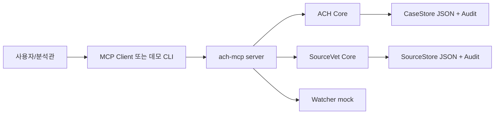
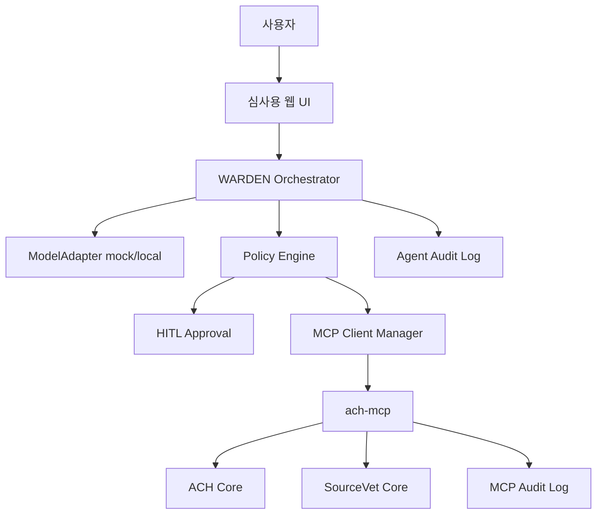

# ACH MCP 방산 챌린지 아키텍처 검증

## 결론

현재 `ach-mcp`의 코어 아키텍처는 좋다. 판단 로직이 LLM 밖에 있고, MCP 도구가 규율을 강제하며, 감사 로그와 Resource 모델도 존재한다. 하지만 방산 챌린지 MVP로는 **에이전트 통제면**과 **사용자 인터페이스**가 빠져 있다.

따라서 아키텍처 목표는 다음처럼 잡는다.

> `ach-mcp`를 규율 엔진으로 유지하고, 그 앞단에 WARDEN 통제형 에이전트 런타임을 붙인다. 모델은 도구 호출을 제안할 뿐이고, 모든 호출은 정책·승인·감사 미들웨어를 통과한다.

## 현재 구조

## 현재 강점

### 1. 판단 로직 분리

`src/core/engine.ts`와 `src/sourcevet/engine.ts`는 LLM 없이 동작한다. 이 구조가 프로젝트의 핵심 자산이다.

- ACH: 경쟁가설 수, 전 칸 평가, 변별력, 최소모순 순위
- SourceVet: 보고 이력 기반 신뢰도, 날조위험, 독립검증 없는 상향 거부

### 2. MCP 인터페이스 명확성

`src/index.ts`에서 tools/resources가 명확히 나뉜다.

- Tools: `open_case`, `add_evidence`, `assess`, `rank_hypotheses`, `register_source`, `assess_source` 등
- Resources: matrix, audit-log, watch-hits, source-profile

### 3. 규율 게이팅

규율 위반 시 도구가 실패한다.

- 경쟁가설 부족
- 신뢰도 없는 증거
- 미평가 칸
- 독립검증 없는 신뢰도 상향

이것이 일반 LLM 앱과의 차별점이다.

### 4. 모델리스 검증

심사관이 외부 API 없이 확인 가능하다.

- `npm run demo:auto`
- `npm run demo -- --module=sourcevet --auto`

## 현재 갭

### 1. 에이전트 런타임 부재

현재는 MCP 서버와 데모가 있다. 하지만 “통제형 에이전트”는 아직 없다.

필요 컴포넌트:

- ModelAdapter
- Orchestrator loop
- Tool call parser
- MCP client manager
- Policy engine
- HITL approval
- Audit middleware

### 2. 정책·권한 모델 부재

현재 MCP 서버 자체는 도구를 제공하지만, 세션별 역할과 허용 범위를 관리하지 않는다.

필요 정책:

- role: analyst, reviewer, admin
- risk: READ, WRITE, DESTRUCTIVE, EXTERNAL
- scope: case-level, tool-level
- approval: 위험도별 승인 필요 여부

### 3. 운영 저장소 부재

현재 JSON 기반 store는 데모에는 충분하지만 운영 PoC에는 약하다.

P0는 JSON으로 유지해도 되지만, P1에서는 SQLite가 적절하다.

### 4. UI 부재

MCP/CLI만 있으면 심사위원에게 “제품”으로 보이기 어렵다.

필요 화면:

- Case Console
- Source Console
- HITL Queue
- Audit Timeline

## 목표 아키텍처 P0

P0에서는 실제 LLM 연동을 필수로 하지 않아도 된다. 모델 어댑터는 mock으로 시작하고, “모델이 제안한 툴콜을 정책이 통제한다”는 구조를 보여주는 것이 우선이다.

## 통제 불변식

아키텍처에서 깨지면 안 되는 규칙:

1. 모델은 MCP 서버를 직접 호출하지 못한다.
2. 모든 툴콜은 정책 엔진을 통과한다.
3. 위험도가 높은 호출은 사람 승인 전 실행되지 않는다.
4. 결정적 판단 툴의 결과를 모델이 뒤집지 못한다.
5. 모든 호출, 거부, 승인, 결과는 append-only audit에 남는다.
6. 외부 전송은 기본 금지이며, EXTERNAL 등급으로 별도 통제한다.

## 위협 모델

| 위협 | 현재 대응 | 추가 필요 |
|---|---|---|
| LLM 환각 | 판단을 엔진에 위임 | 최종 출력 검증 |
| 확증편향 | ACH 전 칸 평가 강제 | UI에서 누락 칸 표시 |
| 단일출처 과신 | SourceVet 상향 거부 | 출처 lineage 시각화 |
| 프롬프트 인젝션 | 설계상 정책 계층 예정 | 실제 policy middleware 구현 |
| 권한 남용 | 현재 없음 | role/scope registry |
| 감사 불가 | MCP audit 있음 | agent-level audit 통합 |
| 외부 유출 | stdio/로컬 구조 | egress 정책 명시 |

## 배포 검증

### P0

- 로컬 단일 프로세스 또는 두 프로세스.
- 외부 API 없이 실행.
- JSON store 유지.
- 데모 UI 또는 CLI+HTML 리포트.

### P1

- 컨테이너 패키징.
- SQLite store.
- 구조화 로그.
- 오프라인 설치 가이드.
- MCP registry 파일.

### P2

- 수요기업 데이터 어댑터.
- local LLM 연결.
- 레드팀/eval.
- 폐쇄망 패키징 시나리오.

## 아키텍처 판정

현재 `ach-mcp`는 규율 엔진으로는 충분히 일관적이다. 방산 챌린지용 MVP에서 부족한 것은 코어가 아니라 **제품화 껍질**이다.

우선 구현해야 할 순서:

1. `packages/warden` 또는 `src/agent`로 통제형 에이전트 런타임 추가.
2. `policy.ts`에 risk/scope/HITL 결정 로직 구현.
3. `audit.ts`에 agent-level audit 추가.
4. `demo/warden-demo.ts`로 자연어 요청 → tool plan → policy → MCP invoke 흐름 구현.
5. 이후 웹 UI를 붙인다.

## 검증 기준

P0가 성공하려면 다음이 보여야 한다.

- 사용자가 “B국 해군훈련 분석해줘”라고 입력한다.
- 에이전트가 필요한 ACH 툴콜 계획을 만든다.
- 정책 엔진이 허용/승인필요/거부를 기록한다.
- `ach-mcp`가 결정적 판단을 반환한다.
- 최종 브리핑은 엔진 결과를 뒤집지 않고 설명만 한다.
- audit timeline에서 전 과정이 재현된다.
