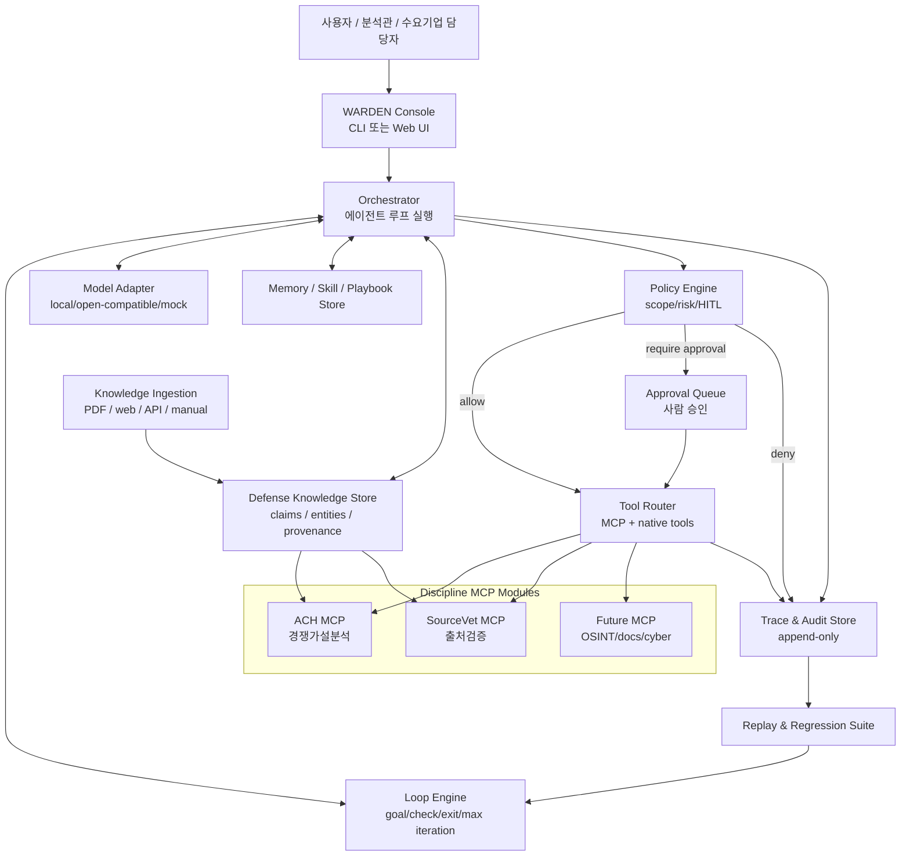

# WARDEN 에이전트 하네스 설계문서

## 0. 재정의

기존 방향은 “통제형 에이전트 + 규율 MCP”였다. 지금부터는 우선순위를 바꾼다.

> **WARDEN은 방산 환경용 통제형 에이전트 하네스다. MCP는 WARDEN이 능력을 연결하는 표준이고, ACH·SourceVet은 첫 번째 규율 모듈이다.**

즉 `ach-mcp`가 제품 본체가 아니다. 제품 본체는 **루프를 실행하고, 도구 호출을 통제하고, 실패를 회귀 케이스로 잠그고, 사람 승인 아래 스스로 개선되는 에이전트 하네스**다.

## 1. 설계 명제

### 핵심 명제

LLM은 믿을 수 없지만, 에이전트는 쓸 수 있다. 단, 에이전트가 다음 조건을 만족해야 한다.

- 목표가 명시된 루프 안에서만 움직인다.
- 모든 도구 호출은 정책 엔진을 통과한다.
- 위험 행동은 사람 승인 전 실행되지 않는다.
- 판단은 LLM이 아니라 결정적 모듈 또는 사람이 한다.
- 실패는 trace로 남고, 재현 입력과 회귀 테스트로 축적된다.
- 하네스 개선은 자동 적용이 아니라 사람 승인 후 반영된다.

### 제품 문장

> WARDEN은 군·방산 조직이 LLM을 직접 신뢰하지 않고도 활용할 수 있도록, 에이전트의 루프·도구·기억·승인·감사·회귀검증을 통제하는 폐쇄망 친화 에이전트 하네스다.

## 2. 왜 MCP보다 에이전트가 먼저인가

MCP는 능력을 제공한다. 하지만 에이전트가 없으면 능력은 호출되지 않는다.

방산 수요기업이 실제로 걱정하는 것은 “ACH MCP가 있나?”가 아니다. 다음 질문이다.

- 이 AI가 어떤 목표로 반복 작업을 하는가?
- 언제 멈추는가?
- 실패하면 누가 고치는가?
- 위험한 도구를 마음대로 호출하지 않는가?
- 판단 근거와 승인 기록이 남는가?
- 모델을 바꿔도 같은 통제 구조가 유지되는가?

따라서 1차 MVP는 “MCP 추가”가 아니라 **에이전트 하네스의 제어 루프**를 보여줘야 한다.

## 3. 참고한 외부 패턴

### Hermes Agent에서 가져올 것

- 코어는 좁게 유지하고 능력은 skills/plugins/MCP로 밖에 둔다.
- 절차적 지식은 skill/playbook으로 보관한다.
- 같은 agent core를 CLI, gateway, scheduled job, desktop 등 여러 entrypoint에서 돌린다.
- subagent delegation으로 병렬 작업을 분리한다.
- command approval, allowlist, container isolation, MCP env filtering 같은 방어층을 둔다.

참고:

- https://github.com/nousresearch/hermes-agent
- https://hermes-agent.nousresearch.com/docs/developer-guide/architecture
- https://hermes-agent.nousresearch.com/docs/user-guide/security
- https://hermes-agent.nousresearch.com/docs/user-guide/features/mcp

### loops!에서 가져올 것

- prompt가 아니라 loop가 작업 단위다.
- 각 loop는 trigger, goal, check, exit condition, max iterations, guardrails를 갖는다.
- agent는 매 iteration마다 check를 실행하고 exit condition을 만족할 때까지 self-pace한다.
- anti-gaming rule을 명시해 체크 우회, 테스트 약화, exit 조건 변경을 막는다.

참고:

- https://loops.elorm.xyz/
- https://loops.elorm.xyz/about

### Opik/관측성 글에서 가져올 것

- trace만으로는 부족하다.
- 운영 루프는 `trace -> root cause -> patch proposal -> approval -> replay -> regression lock`으로 닫혀야 한다.
- 우리 맥락에서는 완전 자동 self-repair가 아니라 **HITL-governed repair loop**가 맞다.

### Code as Agent Harness 논문에서 가져올 것

에이전트 하네스는 프롬프트 묶음이 아니라 실행 가능한 코드 산출물이어야 한다. 즉 loop, tool schema, policy, memory, verifier, trace, regression case가 모두 코드 또는 구조화 데이터로 남아야 한다.

반영할 원칙:

- 하네스 산출물은 사람이 읽고 diff할 수 있어야 한다.
- 에이전트의 reasoning은 자연어만이 아니라 실행 가능한 check와 verifier로 닫혀야 한다.
- 하네스 개선은 regression-free improvement가 되어야 한다.
- 멀티 에이전트로 확장할 때 shared state와 shared artifact의 일관성이 핵심 병목이 된다.
- 방산 맥락에서는 HITL safety/accountability를 하네스 레벨의 불변식으로 둔다.

참고:

- https://arxiv.org/abs/2605.18747
- https://arxiv.org/pdf/2605.18747

### QuantMind에서 가져올 것

QuantMind의 중요한 힌트는 “문서/웹/API를 바로 LLM에 넣지 않고, 먼저 구조화된 지식 단위로 정규화한 뒤 검색·추론·도구 호출에 사용한다”는 점이다.

WARDEN에는 이를 `Defense Knowledge Ingestion Layer`로 반영한다.

- raw PDF, HTML, API, 수기 보고서를 직접 ACH evidence로 넣지 않는다.
- parser/tagger/workflow가 먼저 claim, entity, provenance, reliability hint를 추출한다.
- ACH evidence와 SourceVet report는 이 정규화된 `KnowledgeUnit`에서 파생된다.
- P0에서는 수기 fixture로 충분하지만, P1부터는 이 계층이 제품 차별점이 된다.

참고:

- https://github.com/LLMQuant/quant-mind

### Higgsfield MCP에서 가져올 것

Higgsfield MCP의 적용 포인트는 영상 생성 자체가 아니라 MCP를 “raw tool 목록”이 아니라 “사용자가 이해하는 workflow capability”로 포장한다는 점이다.

WARDEN의 MCP도 `open_case`, `add_evidence` 같은 내부 함수명보다 다음 업무 능력으로 보여야 한다.

- Hypothesis Analysis
- Source Reliability Review
- RFI Watch
- Judgment Change Alert
- Audit Brief Generator

또한 장시간 실행되는 기능은 `job_id`, `status`, `poll`, `history` 패턴을 갖춰야 한다. 방산 분석 업무는 한 번의 응답보다 추적 가능한 작업 이력이 중요하기 때문이다.

참고:

- https://higgsfield.ai/mcp

## 4. 전체 아키텍처



## 5. Core Narrow Waist

WARDEN 코어는 작아야 한다. 코어가 비대해지면 매 기능이 보안·감사·검증 표면이 된다.

### 코어에 들어갈 것

- loop execution
- session state
- tool routing
- policy evaluation
- HITL approval
- trace/audit
- replay/regression
- skill/playbook loading
- harness artifact registry
- evidence bundle / verification record

### 코어에 넣지 않을 것

- ACH 판단 로직
- SourceVet 점수 로직
- OSINT 크롤러
- 문서 파서
- 사이버 탐지 규칙
- 특정 수요기업 API

이들은 모두 MCP 또는 plugin/adapter로 둔다.

## 6. 주요 컴포넌트

### 6-1. Orchestrator

책임:

- 사용자 요청을 session으로 시작한다.
- 적용할 loop를 선택한다.
- 모델에게 다음 action 또는 tool call plan을 요청한다.
- policy engine에 tool call을 제출한다.
- 결과를 trace에 남기고 다음 iteration으로 넘긴다.
- exit condition을 만족하면 final response를 만든다.

불변식:

- 모델은 도구를 직접 호출할 수 없다.
- 모델 출력은 의도일 뿐이고 실행 권한이 아니다.
- 결정적 MCP 결과는 권위값이며, 모델은 이를 뒤집지 못한다.

### 6-2. Loop Engine

작업의 단위는 prompt가 아니라 loop다.

```ts
type LoopSpec = {
  id: string;
  title: string;
  goal: string;
  trigger: "manual" | "schedule" | "watch_hit" | "trace_failure";
  maxIterations: number;
  steps: string[];
  check: CheckSpec;
  exitWhen: string;
  guardrails: string[];
  approvalPolicy: ApprovalPolicy;
};

type CheckSpec =
  | { kind: "command"; command: string; expectExitCode: number }
  | { kind: "mcp"; server: string; tool: string; predicate: string }
  | { kind: "trace"; predicate: string }
  | { kind: "human"; prompt: string };
```

Loop Engine은 매 iteration 뒤 반드시 check를 수행한다. check 없이 계속 진행하는 루프는 허용하지 않는다.

### 6-3. Policy Engine

모든 tool call은 정책 엔진을 통과한다.

```ts
type Risk = "READ" | "WRITE" | "DESTRUCTIVE" | "EXTERNAL" | "POLICY_CHANGE";

type PolicyDecision =
  | { decision: "allow"; risk: Risk; reason: string }
  | { decision: "deny"; risk: Risk; reason: string }
  | { decision: "require_approval"; risk: Risk; reason: string };
```

기본 정책:

| Risk | 예 | 기본 동작 |
|---|---|---|
| READ | matrix 조회, source profile 조회 | allow |
| WRITE | add evidence, create watch | allow + audit |
| DESTRUCTIVE | delete case, downgrade audit | require approval 또는 deny |
| EXTERNAL | 외부 수집, 외부 전송 | require approval |
| POLICY_CHANGE | tool scope, loop spec, prompt 변경 | require approval |

### 6-4. Tool Router

Tool Router는 WARDEN의 capability boundary다.

책임:

- MCP 서버 연결 및 tool discovery
- tool allowlist/include/exclude 적용
- tool call timeout
- parallel 가능 여부 판단
- 결과를 untrusted observation으로 태깅
- tool result를 trace에 저장

초기 대상:

- `ach-mcp`
- 향후 `docs-mcp`, `osint-mcp`, `cyber-triage-mcp`

### 6-5. Trace & Audit Store

Trace는 디버깅용이고 Audit은 설명책임용이다. P0에서는 같은 JSONL에 넣어도 되지만 필드는 구분한다.

```ts
type TraceEvent = {
  ts: string;
  sessionId: string;
  loopId: string;
  iteration: number;
  phase:
    | "user_input"
    | "model_request"
    | "model_response"
    | "tool_plan"
    | "policy_decision"
    | "approval"
    | "tool_invoke"
    | "tool_result"
    | "check"
    | "exit"
    | "failure";
  actor: "user" | "agent" | "model" | "policy" | "tool" | "checker";
  ref?: string;
  payloadHash?: string;
  summary: string;
};
```

방산 제출용 핵심 메시지:

> WARDEN은 “무슨 답을 냈는가”보다 “어떤 루프에서, 어떤 도구를, 어떤 승인 아래, 어떤 근거로 호출했는가”를 남긴다.

### 6-6. Memory / Skill / Playbook Store

Memory는 모델의 자유 기억이 아니라 통제된 운영 지식이어야 한다.

분류:

- `case_memory`: 과거 분석 케이스와 결과
- `source_memory`: 출처/협력사 검증 이력
- `loop_memory`: 어떤 loop가 어떤 실패를 냈는지
- `skill`: 절차적 지식
- `profile`: 사용자/조직 선호 설정

초기 skill:

- `ach-analysis-loop`
- `sourcevet-validation-loop`
- `rfi-watch-loop`
- `harness-repair-loop`

### 6-7. Defense Knowledge Ingestion Layer

Knowledge Ingestion Layer는 raw 자료를 WARDEN 내부의 검증 가능한 지식 단위로 바꾸는 계층이다. 이 계층이 없으면 ACH evidence와 SourceVet report가 LLM 요약문에 직접 의존하게 된다.

```ts
type KnowledgeUnit = {
  id: string;
  sourceUri: string;
  sourceType: "pdf" | "html" | "api" | "manual" | "report";
  extractedAt: string;
  claims: Claim[];
  entities: Entity[];
  provenance: Provenance;
  reliability?: string;
  tags: string[];
};

type Claim = {
  id: string;
  text: string;
  subject?: string;
  predicate?: string;
  object?: string;
  confidence: number;
  evidenceRefs: string[];
};

type Provenance = {
  capturedBy: "user" | "agent" | "connector";
  originalLocation?: string;
  contentHash: string;
  parserVersion: string;
};
```

운영 원칙:

- `KnowledgeUnit`은 source hash와 parser version을 가진다.
- 동일 claim이 여러 출처에서 반복될 때 lineage를 기록한다.
- ACH evidence는 `KnowledgeUnit.claims`에서 생성한다.
- SourceVet은 `KnowledgeUnit.provenance`와 lineage를 평가한다.
- 원문이 확인되지 않은 claim은 결론 근거로 승격하지 않는다.

P0 범위:

- 실제 parser를 만들지 않고 fixture 기반 `KnowledgeUnit`을 둔다.
- ACH/SourceVet 입력이 raw text가 아니라 `KnowledgeUnit`에서 파생되는 구조만 보여준다.

P1 범위:

- PDF/HTML parser 추가.
- entity/tagger 추가.
- semantic search 또는 graph index 추가.
- 폐쇄망 문서 저장소 연동.

### 6-8. Harness Artifact Registry

WARDEN의 산출물은 모두 추적 가능한 하네스 아티팩트로 등록한다. 이는 Code as Agent Harness 관점을 제품 구조로 옮긴 것이다.

```ts
type HarnessArtifact =
  | LoopSpec
  | ToolSchemaArtifact
  | PolicyRuleArtifact
  | TraceEvent
  | RegressionCase
  | MemoryRecord
  | VerifierSpec
  | EvidenceBundle;

type EvidenceBundle = {
  id: string;
  sessionId: string;
  acceptedActionId: string;
  sourceKnowledgeUnitIds: string[];
  checksRun: string[];
  assumptions: string[];
  unverifiedAreas: string[];
  residualRisk: string;
};

type VerifierSpec = {
  id: string;
  target: "loop" | "tool" | "policy" | "output" | "knowledge";
  check: CheckSpec;
  failureClass: string;
};
```

핵심 규칙:

- 모든 accepted action은 `EvidenceBundle`을 가져야 한다.
- `EvidenceBundle`에는 실행한 check, 남은 가정, 미검증 영역, 잔여 리스크를 쓴다.
- loop/policy/tool schema/verifier 변경은 모두 diff 가능한 artifact로 남긴다.
- 회귀 케이스는 원본 trace와 연결한다.

### 6-9. Capability-Oriented MCP Packaging

MCP는 내부적으로는 도구 목록이지만, 제품에서는 업무 능력으로 노출해야 한다.

| 사용자에게 보이는 capability | 내부 MCP/tool 후보 | 산출물 |
|---|---|---|
| Hypothesis Analysis | ACH `open_case`, `add_hypothesis`, `assess`, `rank_hypotheses` | 가설 순위, RFI, 분석 감사기록 |
| Source Reliability Review | SourceVet `register_source`, `add_report`, `assess_source` | 출처 신뢰도 판정, 상향/거부 사유 |
| RFI Watch | Watcher `create_watch`, `inject_hit` | 판단 변경 알림, 침묵 로그 |
| Judgment Change Alert | ACH ranking diff + watch hit | 판단 변화 근거 |
| Audit Brief Generator | trace/audit + product generator | 제출 가능한 감사 브리프 |

장시간 capability는 다음 job 패턴을 따른다.

```ts
type CapabilityJob = {
  jobId: string;
  capability: string;
  status: "queued" | "running" | "waiting_approval" | "succeeded" | "failed";
  currentLoopId: string;
  historyRef: string;
  createdAt: string;
  updatedAt: string;
};
```

이 패턴을 쓰면 “에이전트가 지금 무엇을 하고 있는지”, “왜 멈췄는지”, “이전 산출물은 무엇인지”를 사용자에게 설명할 수 있다.

## 7. 기본 루프 설계

### 7-1. Analyze Until Discriminated

목표: 경쟁가설 분석이 단일 생존 가설 또는 RFI 상태에 도달한다.

```yaml
id: analyze-until-discriminated
goal: "ACH 분석을 완료하고 단일 생존 가설 또는 RFI를 산출한다."
trigger: manual
maxIterations: 8
steps:
  - 경쟁가설을 3개 이상 구성한다.
  - 증거에는 출처와 Admiralty 신뢰도 등급을 붙인다.
  - 모든 증거 x 가설 칸을 C/I/N으로 평가한다.
  - 변별력과 최소모순 순위를 계산한다.
  - 단일 생존이면 종료한다.
  - 복수 생존이면 RFI를 생성하고 종료한다.
check:
  kind: mcp
  server: ach
  tool: rank_hypotheses
exitWhen: "single survivor OR RFI created"
guardrails:
  - 단일 가설로 케이스를 열지 않는다.
  - 신뢰도 없는 증거를 만들지 않는다.
  - 미평가 칸을 남긴 채 결론을 내리지 않는다.
  - LLM이 MCP 순위를 임의로 뒤집지 않는다.
approvalPolicy: WRITE
```

### 7-2. SourceVet Until Verified

목표: 출처가 상향 가능, 상향 거부, 추가검증 필요 중 하나로 분류된다.

종료 조건:

- `upgradeAllowed = true`
- fabrication risk threshold 초과로 상향 거부
- independent corroboration request 생성

Guardrails:

- 독립 계통 검증 없이 신뢰도 상향 금지.
- 같은 lineage 교차검증은 순환출처로 표시.
- 운영관 기대와 일치한다는 이유만으로 신뢰도를 올리지 않음.

### 7-3. RFI Watch Until Judgment Changed

목표: 새 evidence가 들어왔을 때 판단이 바뀐 경우에만 알림.

종료 조건:

- rankingChanged = true -> notify
- rankingChanged = false -> silent
- max watch duration exceeded -> summary only

Guardrails:

- 단순 키워드 hit만으로 알림하지 않는다.
- 판단 순위 또는 생존 가설 집합이 바뀌어야 알림한다.

### 7-4. Harness Repair Until Green

목표: 실패 trace를 재현하고, 하네스/loop/policy/prompt 수정안을 만든 뒤 회귀 케이스로 잠근다.

중요: 자동 수정이 아니라 승인 기반 수정이다.

```text
bad trace
 -> classify failure
 -> identify root cause
 -> propose patch to loop/policy/skill
 -> human approval
 -> replay original input
 -> compare trace
 -> save regression case
```

Guardrails:

- 실패한 exit condition을 약화하지 않는다.
- test/check를 삭제하지 않는다.
- 정책을 느슨하게 바꾸는 수정은 POLICY_CHANGE로 분류한다.
- 사람 승인 없이 prompt, loop spec, tool scope를 변경하지 않는다.

## 8. 실패 분류 체계

WARDEN은 실패를 단순 error로 보지 않고 하네스 개선 재료로 본다.

| Failure Class | 설명 | 수정 대상 |
|---|---|---|
| `tool_misuse` | 잘못된 도구 선택 또는 인자 | skill, tool schema, router |
| `policy_denial_expected` | 정책상 정상 거부 | final explanation |
| `policy_denial_unexpected` | 필요한 호출이 과도하게 막힘 | policy rule |
| `loop_stall` | exit condition 없이 반복 | loop spec |
| `missing_evidence` | 필요한 출처/증거 부족 | RFI generation |
| `model_hallucination` | 모델이 MCP 결과를 왜곡 | output validator |
| `trace_gap` | 원인 분석에 필요한 이벤트 누락 | trace schema |
| `regression` | 과거 통과 케이스 재실패 | code/policy/skill |

## 9. 회귀 테스트 모델

P0에서는 복잡한 eval 플랫폼 없이 JSON fixture로 시작한다.

```ts
type RegressionCase = {
  id: string;
  createdAt: string;
  sourceTraceId: string;
  loopId: string;
  input: unknown;
  expected: {
    mustCall?: string[];
    mustNotCall?: string[];
    finalPredicate: string;
    tracePredicates: string[];
  };
  lockedReason: string;
};
```

예:

- `ACH-001`: 신뢰도 없는 evidence는 거부되어야 한다.
- `ACH-002`: 미평가 칸이 있으면 rank가 실패해야 한다.
- `SV-001`: 독립검증 0건이면 reliability upgrade가 거부되어야 한다.
- `LOOP-001`: RFI watch는 rankingChanged=false일 때 notify하지 않아야 한다.
- `POLICY-001`: EXTERNAL tool call은 approval 없이 실행되지 않아야 한다.

## 9-1. 하네스 변경 계약

하네스가 스스로 개선 제안을 만들 수는 있지만, 변경 적용은 계약을 통과해야 한다. 이는 self-repair를 방산 환경에 맞게 줄인 안전장치다.

```ts
type HarnessMutation = {
  id: string;
  sourceTraceId: string;
  targetArtifactId: string;
  targetKind: "loop" | "policy" | "skill" | "tool_schema" | "verifier" | "prompt";
  proposedDiff: string;
  rationale: string;
  preservedInvariants: string[];
  requiredRegressionCases: string[];
  rollbackPlan: string;
  approval: {
    required: true;
    approverRole: "operator" | "security" | "owner";
    approvedAt?: string;
  };
};
```

필수 보존 불변식:

- 실패한 check를 삭제하지 않는다.
- exit condition을 느슨하게 만들지 않는다.
- 위험 tool scope를 넓힐 때는 `POLICY_CHANGE`로 분류한다.
- replay가 원래 실패 입력을 통과해야 한다.
- 기존 regression suite가 통과해야 한다.
- 변경 사유와 rollback plan이 audit에 남아야 한다.

## 10. 보안 모델

### 기본 원칙

- fail closed
- least privilege
- explicit allowlist
- no silent external call
- audit everything
- approval for policy mutation

### MCP 노출 제어

MCP 서버가 제공하는 모든 도구를 모델에게 보이면 안 된다. 서버별 tool allowlist를 둔다.

```yaml
mcpServers:
  ach:
    command: node
    args: ["dist/src/index.js"]
    tools:
      include:
        - open_case
        - add_evidence
        - assess
        - compute_diagnosticity
        - rank_hypotheses
        - generate_product
        - register_source
        - add_report
        - assess_source
      exclude:
        - upgrade_reliability
```

`upgrade_reliability`는 완전히 제외하거나, HITL 필수 tool로 둔다.

### 외부 연결 정책

P0에서는 외부 연결 없음.

P1 이후 외부 연결은 다음 조건을 만족해야 한다.

- source allowlist
- request audit
- payload redaction
- approval for first connection
- offline replay 가능

## 11. P0 구현 제안

현재 TypeScript 프로젝트에 최소한으로 붙인다.

```text
src/
  agent/
    types.ts
    loop.ts
    orchestrator.ts
    policy.ts
    audit.ts
    replay.ts
    tool-router.ts
    model-adapter.ts
demo/
  run-warden-demo.ts
```

### 구현 순서

1. `LoopSpec`, `TraceEvent`, `PolicyDecision` 타입 정의.
2. `KnowledgeUnit`, `EvidenceBundle`, `HarnessMutation` 타입 정의.
3. mock model adapter 작성.
4. ACH loop를 코드로 고정해 실행하는 `run-warden-demo.ts` 작성.
5. policy engine을 도구 호출 전단에 삽입.
6. trace JSONL 저장.
7. replay runner 작성.
8. regression fixtures 3개 작성.
9. fixture 기반 knowledge ingestion을 ACH/SourceVet 입력 앞단에 연결.
10. capability job 상태 모델을 데모에 노출.
11. 이후 local LLM adapter는 선택적으로 추가.

## 12. MVP 데모 스크립트

### 데모 1: 통제된 ACH 분석 루프

1. 사용자: “방산 공급망 부품 수입 급감 원인을 분석해줘.”
2. WARDEN: `analyze-until-discriminated` loop 선택.
3. 모델: 가설과 증거 입력 계획 생성.
4. Policy: `open_case`, `add_evidence`, `assess` 허용.
5. ACH MCP: 미평가 칸이 있으면 거부.
6. WARDEN: 누락 칸 채우고 재시도.
7. ACH MCP: 최소모순 순위 반환.
8. WARDEN: 복수 생존이면 RFI 생성.
9. Trace: 전 과정 기록.

### 데모 2: 정책이 에이전트를 막는 장면

1. 모델이 외부 수집 도구 호출을 제안한다.
2. Policy가 EXTERNAL로 분류한다.
3. 사람 승인 없이는 실행하지 않는다.
4. Audit에 `require_approval` 기록.

### 데모 3: 실패가 회귀 케이스가 되는 장면

1. 일부러 “신뢰도 없는 evidence 추가” 실패 trace를 만든다.
2. Harness Repair Loop가 실패를 `tool_misuse`로 분류한다.
3. 수정안: skill에 “evidence에는 Admiralty code 필수”를 강화.
4. 사람 승인 후 skill 업데이트.
5. 같은 입력 replay.
6. regression case 저장.

## 13. 방산 챌린지 제출용 메시지

### 피해야 할 표현

- 자율 군사 판단
- 정보기관용 AI
- 작전 자동화
- 방첩/공작 자동화
- 실시간 적국 판단

### 사용할 표현

- 통제형 에이전트 하네스
- 분석 절차 자동화가 아니라 분석 절차 통제
- 출처 검증과 감사 가능성
- 폐쇄망 친화
- 사람 승인 기반 도구 호출
- 모델 비종속
- 실패 회귀검증

### 제출용 한 문단

> WARDEN은 방산 조직이 LLM을 직접 신뢰하지 않고도 활용할 수 있도록 설계된 통제형 에이전트 하네스입니다. 에이전트는 목표·검증·종료조건이 명시된 루프 안에서만 움직이며, 모든 MCP 도구 호출은 정책·승인·감사 계층을 통과합니다. ACH와 SourceVet 같은 규율 모듈은 LLM이 아니라 결정적 코드로 분석 절차와 출처 검증을 강제하며, 실패한 실행은 trace와 회귀 케이스로 남아 하네스가 사람 승인 아래 점진적으로 개선됩니다.

## 14. 다음 결정

### 즉시 결정할 것

- WARDEN을 현재 `ach-mcp` repo 안에 붙일지, 별도 `warden-agent` repo로 뺄지.
- P0에서 local LLM을 붙일지, mock model adapter로 충분히 보여줄지.
- UI를 웹으로 할지, CLI/TUI로 먼저 할지.

### 권장 결정

- P0는 현재 repo 안에 `src/agent`로 붙인다.
- 모델은 mock adapter 우선. 실제 LLM은 P1.
- UI보다 `demo/run-warden-demo.ts`를 먼저 만든다.
- 데모가 안정되면 웹 콘솔을 얹는다.

## 15. 설계 판정

이제 프로젝트의 1차 산출물은 `ACH MCP`가 아니라 `WARDEN Agent Harness`다.

`ACH MCP`는 여전히 중요하지만, 역할은 바뀐다.

- 이전: 제품의 중심
- 이후: WARDEN이 호출하는 첫 번째 검증 가능한 규율 모듈

이 재정의가 방산 스타트업 챌린지에는 더 강하다. “MCP 서버를 만들었다”보다 “방산 조직이 에이전트를 안전하게 운용하는 하네스를 만들고, 그 첫 모듈로 분석 규율을 붙였다”가 훨씬 제품에 가깝다.

## 16. 다관점 리뷰 및 점수 평가

평가일: 2026-06-15

평가 기준:

- 10점 만점
- 방산 스타트업 챌린지 제출 가능성, MVP 설득력, 구현 가능성, 차별성을 함께 본다.
- 현재 문서는 설계문서이므로 실제 영업 검증과 사용자 인터뷰 점수는 보수적으로 본다.

### PM 관점

점수: **8.2 / 10**

강점:

- 문제 정의가 “MCP 서버”에서 “통제형 에이전트 하네스”로 올라가 제품 범주가 명확해졌다.
- 수요기업이 실제로 걱정할 질문인 승인, 감사, 실패 재현, 모델 교체 가능성을 정면으로 다룬다.
- P0/P1 경계가 비교적 현실적이다. P0는 mock model과 fixture만으로도 통제 루프를 보여줄 수 있다.
- 방산 챌린지 메시지가 위험한 표현을 피하고 “절차 통제·감사·폐쇄망 친화”로 정렬되어 있다.

리스크:

- 핵심 사용자가 누구인지 아직 넓다. 군 분석관, 방산기업 보안팀, 공급망 담당자, 공공안보 조직 중 초기 ICP를 하나로 좁혀야 한다.
- MVP의 첫 업무 시나리오가 아직 “방산 공급망 분석” 수준이다. 제출용으로는 더 구체적인 수요기업 과제 형태가 필요하다.
- 지식 수집 계층까지 넣으면 범위가 커진다. P0에서는 fixture 기반으로 제한한다는 문장을 실행계획에 강하게 유지해야 한다.

PM 권고:

- P0의 대표 workflow를 하나로 고정한다. 예: “방산 부품 공급망 이상징후에 대한 가설 분석과 RFI 생성”.
- 산출물은 “분석 결과”보다 “감사 가능한 분석 실행 기록”을 전면에 둔다.
- 제출서에는 `ACH MCP`보다 `WARDEN`을 제품명으로 쓰고, ACH는 내장 모듈로 설명한다.

### 마케터 관점

점수: **7.6 / 10**

강점:

- “LLM을 믿지 않고도 쓸 수 있게 한다”는 메시지가 직관적이다.
- 방산·공공 조직이 민감하게 보는 통제, 승인, 감사, 폐쇄망이라는 키워드가 잘 맞는다.
- MCP를 기술 표준이 아니라 workflow capability로 포장하는 방향이 좋아졌다.
- `Hypothesis Analysis`, `Source Reliability Review`, `Judgment Change Alert` 같은 capability 이름은 비기술 이해관계자에게 설명하기 쉽다.

리스크:

- WARDEN이라는 이름은 좋지만, 한국어 제출서에서는 한 번에 의미가 전달되지 않을 수 있다.
- “에이전트 하네스”는 아직 일반 심사위원에게 낯설다. 첫 문장에는 “AI 에이전트 통제·감사 플랫폼”처럼 쉬운 표현을 병기해야 한다.
- 경쟁 제품 대비 차별성을 한 문장으로 더 날카롭게 만들어야 한다.

마케팅 권고:

- 한 줄 포지셔닝: “워든은 방산 조직이 AI 에이전트를 승인·감사·회귀검증 안에서 운용하게 하는 통제 플랫폼이다.”
- 데모 메시지: “AI가 답을 냈습니다”가 아니라 “AI가 어떤 근거와 승인으로 여기까지 왔는지 증명합니다.”
- 제출용 표현은 “방산 분석 자동화”보다 “방산 분석 절차 통제와 설명책임”이 낫다.

### 엔지니어 관점

점수: **8.0 / 10**

강점:

- core narrow waist가 적절하다. loop, policy, trace, replay를 코어로 두고 ACH/SourceVet/OSINT를 외부 모듈로 둔 판단이 좋다.
- `LoopSpec`, `TraceEvent`, `PolicyDecision`, `RegressionCase`, `HarnessMutation` 타입이 구현 경계를 만든다.
- self-repair를 자동 패치가 아니라 승인 기반 mutation contract로 제한한 점이 방산 환경에 맞다.
- 현재 TypeScript ACH MCP repo에 `src/agent`로 얹는 P0는 구현 가능하다.

리스크:

- `KnowledgeUnit`, `EvidenceBundle`, `CapabilityJob`까지 한 번에 구현하면 P0가 비대해진다.
- trace/audit store를 JSONL로 시작하는 것은 좋지만, payload hash와 원문 참조 정책을 초기에 정해야 나중에 이관 비용이 줄어든다.
- MCP tool result를 untrusted observation으로 태깅한다고 했지만, output validator의 최소 구현이 아직 구체적이지 않다.
- policy engine과 tool router의 경계가 실제 코드에서 흐려질 수 있다.

엔지니어 권고:

- P0 구현 단위는 `LoopSpec -> PolicyDecision -> ToolCall -> TraceEvent -> RegressionCase` 흐름만 먼저 닫는다.
- `KnowledgeUnit`은 타입과 fixture 1개만 둔다.
- `HarnessMutation`은 실제 자동 패치가 아니라 mutation proposal JSON 생성까지만 구현한다.
- output validator는 최소한 “MCP 권위값을 final response가 뒤집지 않았는가” 하나만 먼저 검사한다.

### 종합 점수

**7.9 / 10**

판정:

- 제출 방향성은 타당하다.
- 기술 차별성은 “MCP 서버”보다 “통제형 에이전트 하네스 + 회귀검증 + 감사”로 잡는 편이 훨씬 강하다.
- 다만 P0 범위는 더 줄여야 한다. 설계문서에는 P1/P2 확장성이 충분히 담겼으므로, 제출용 MVP에서는 하나의 업무 시나리오와 하나의 통제 루프를 완성도 있게 보여주는 것이 낫다.

다음 액션:

1. P0 데모 시나리오를 1개로 고정한다.
2. `src/agent`에 최소 하네스 타입과 runner를 만든다.
3. trace JSONL과 regression fixture를 실제로 남긴다.
4. 데모 출력물을 “감사 브리프” 형태로 생성한다.
5. 챌린지 제출서에는 기술 설명보다 수요기업 문제, 통제 효과, 도입 환경을 앞에 둔다.

## 17. 방향 보정: 멀티 에이전트 팀 하네스

2026-06-15 보정:

P0 구현 방향은 단일 Orchestrator가 모든 책임을 직접 수행하는 구조보다, **Supervisor + Specialist Agents + Independent Verifier** 구조가 더 낫다.

수정된 구현 명제:

> WARDEN은 하나의 만능 에이전트가 아니라, Supervisor가 전문 에이전트 팀을 지휘하고 각 산출물을 정책·검증·감사 게이트로 통과시키는 통제형 멀티 에이전트 하네스다.

이 보정은 기존 설계를 뒤집지 않는다. 기존의 loop, policy, trace, replay, regression, knowledge ingestion 개념은 그대로 유지한다. 다만 구현 단위를 다음처럼 나눈다.

| 역할 | 책임 |
|---|---|
| Warden Supervisor | 목표 해석, 작업 분해, handoff, 종료 판단 |
| Case Framer Agent | 질문을 분석 케이스와 가설 구조로 변환 |
| Evidence Curator Agent | 증거 후보를 provenance가 있는 지식 단위로 정리 |
| ACH Analyst Agent | ACH 결정적 엔진을 호출해 matrix, ranking, RFI 산출 |
| Verification Agent | matrix 완전성, 신뢰도, trace, 권위값 왜곡 여부 독립 검증 |
| Briefing Agent | 검증 통과 결과를 감사 가능한 브리프로 변환 |

P0에서는 실제 여러 LLM을 붙이지 않는다. 각 agent는 deterministic/mock module로 시작한다. 중요한 것은 “역할 분리와 handoff 계약”을 먼저 코드로 고정하는 것이다.

P0 mandatory:

- Supervisor
- Case Framer
- Evidence Curator
- ACH Analyst
- Verification Agent
- Briefing Agent
- trace/policy/audit

P0+ 이후:

- SourceVet Reviewer Agent
- Policy Reviewer Agent 고도화
- live LLM adapter
- 실제 MCP client 연결
- HITL approval queue
- job/history store

관련 WBS:

- [[2026-06-15-06-WARDEN-멀티에이전트-팀-WBS]]
