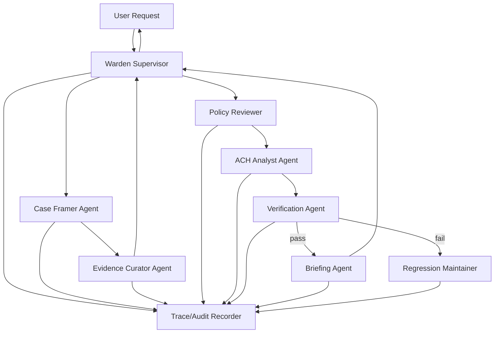
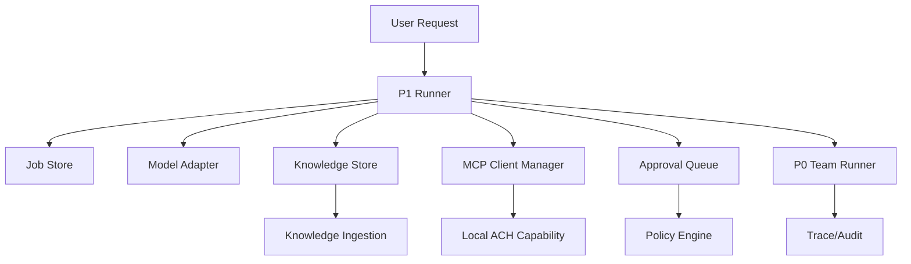

# WARDEN 멀티 에이전트 팀 개발 WBS

## 0. 방향 전환

기존 P0 설계는 단일 Orchestrator가 loop, policy, tool routing, trace, replay를 모두 직접 다루는 구조였다.

수정 방향:

> WARDEN은 단일 에이전트가 아니라 **Supervisor가 전문 에이전트 팀을 지휘하고, 각 에이전트 산출물을 정책·검증·감사 게이트로 통과시키는 멀티 에이전트 하네스**다.

P0에서 중요한 점은 실제 LLM 에이전트를 여러 개 붙이는 것이 아니다. 먼저 **역할 분리, handoff 계약, 검증자 에이전트, trace**를 코드로 구현한다. 각 역할은 P0에서는 deterministic/mock module로 시작하고, P1부터 모델 adapter를 붙인다.

선택 패턴:

- `Supervisor`: 전체 목표, 작업 분해, handoff, 종료 판단
- `Specialist Pool`: 사례 구성, 증거 정리, ACH 분석, 검증, 브리핑
- `Generate-Verify`: 분석 에이전트가 산출하고 검증 에이전트가 독립 검사
- `Policy-Gated Tool Use`: 모든 도구 호출은 정책 평가 후 실행

## 1. 제품 기준

### 도메인

방산 조직의 분석 업무에서 AI 에이전트가 직접 판단하지 못하게 하고, 역할별 에이전트 산출물을 결정적 규율 모듈과 감사 로그로 통제한다.

P0 대표 시나리오:

> “가상 방산 공급망 핵심 부품 수입 급감의 원인을 분석하고, 생존 가설·RFI·감사 브리프를 생성한다.”

### 핵심 작업

1. 사용자 질문을 분석 케이스로 구조화한다.
2. 가설과 증거 후보를 만든다.
3. 증거를 `KnowledgeUnit` 또는 fixture로 정규화한다.
4. ACH 결정적 엔진으로 전 칸 평가와 순위를 계산한다.
5. 검증 에이전트가 누락, 정책 위반, 권위값 왜곡을 검사한다.
6. 브리핑 에이전트가 감사 가능한 산출물로 정리한다.
7. trace와 regression case로 재현 가능하게 남긴다.

### 품질 기준

- LLM 또는 mock agent는 판단 권위가 아니다.
- ACH/SourceVet 같은 결정적 모듈 결과가 권위값이다.
- 모든 handoff는 구조화 데이터로 남는다.
- 모든 tool call은 policy decision을 가진다.
- final brief는 trace와 evidence bundle을 참조한다.
- P0는 외부 네트워크, 실제 문서 파서, UI, live LLM 없이 통과해야 한다.

## 2. 멀티 에이전트 팀 구성

| Agent | P0 필수 | 책임 | 입력 | 출력 | 권한 |
|---|---:|---|---|---|---|
| Warden Supervisor | 예 | 전체 목표 해석, 작업 분해, handoff 관리, 종료 판단 | 사용자 요청, 팀 상태 | `TeamPlan`, `AgentTask`, final decision | 직접 tool 실행 불가 |
| Case Framer Agent | 예 | 질문을 분석 프레임으로 변환, 가설 초안 구성 | 사용자 요청, 시나리오 fixture | `CaseFrame` | READ only |
| Evidence Curator Agent | 예 | 증거 후보를 정규화하고 provenance 부여 | 시나리오 evidence, source metadata | `KnowledgeUnit[]`, `EvidenceBundle[]` | READ only |
| ACH Analyst Agent | 예 | ACH case 생성, 증거 등록, 평가, 순위 계산 | `CaseFrame`, `EvidenceBundle[]` | `AchAnalysisResult` | WRITE tool call, policy 필요 |
| Verification Agent | 예 | 산출물 독립 검증, 회귀 조건 확인 | trace, ACH result, brief draft | `VerificationReport` | READ only |
| Briefing Agent | 예 | 감사 가능한 최종 브리프 작성 | ACH result, verification report, trace summary | `AuditBrief` | READ only |
| Policy Reviewer Agent | P0.2부터 | tool call risk 분류와 승인 요구 판단 | planned tool call | `PolicyDecision` | policy authority |
| SourceVet Reviewer Agent | P0+ | 출처 신뢰도와 순환출처 위험 평가 | `KnowledgeUnit[]`, source profile | `SourceReview` | WRITE tool call, policy 필요 |
| Regression Maintainer Agent | P0+ | 실패 trace를 regression case로 저장 | failed trace, verifier report | `RegressionCase` | WRITE local fixture |

P0 최소 팀:

- Warden Supervisor
- Case Framer Agent
- Evidence Curator Agent
- ACH Analyst Agent
- Verification Agent
- Briefing Agent

P0에서 SourceVet은 mandatory가 아니다. 공급망 ACH 데모가 안정된 뒤 P0+ 또는 P1로 넣는다.

## 3. Handoff 그래프



핵심 원칙:

- Supervisor는 팀을 지휘하지만 도구를 직접 실행하지 않는다.
- Specialist agent는 자기 역할 산출물만 만든다.
- ACH Analyst는 policy 승인 없이는 WRITE 계열 도구를 실행하지 않는다.
- Verification Agent는 ACH Analyst와 독립된 pass/fail 판단을 한다.
- Briefing Agent는 검증 실패 산출물을 최종 브리프로 만들 수 없다.

## 4. P0 범위 축소 원칙

엔지니어 관점에서 P0가 커지는 것을 막기 위해 다음은 명시적으로 제외한다.

P0 제외:

- live LLM adapter
- 실제 MCP client 연결
- 외부 웹/PDF ingestion
- UI/Web console
- SourceVet mandatory workflow
- 자동 self-repair patch 적용
- 병렬 subagent 실행
- 장기 job queue

P0 포함:

- 역할별 agent module
- handoff contract
- deterministic team runner
- local ACH adapter
- policy decision
- trace JSONL
- verification report
- audit brief
- 최소 regression fixture

## 5. 전체 마일스톤

| Milestone | 목표 | 완료 산출물 | 성공 기준 |
|---|---|---|---|
| M0 | 방향 정렬 | 이 WBS 문서 | P0/P0+/P1 경계 합의 |
| M1 | 계약/타입 고정 | `src/agent/types.ts` | `npm run build` 통과 |
| M2 | 팀 러너 골격 | `src/agent/team-runner.ts` | mock 팀 실행 trace 생성 |
| M3 | ACH Analyst 연결 | `src/agent/tools/ach-local.ts` | 공급망 ACH 결과 생성 |
| M4 | 검증자 에이전트 | `src/agent/agents/verifier.ts` | 의도적 실패를 잡음 |
| M5 | 감사 브리프 | `src/agent/agents/briefing.ts` | 심사용 CLI demo 완성 |
| M6 | 회귀 fixture | `src/agent/regression.ts` | regression command 통과 |
| M7 | SourceVet 확장 | `src/agent/agents/sourcevet-reviewer.ts` | optional source review 통과 |

## 6. 개발 페이즈 WBS

### P0.0 방향 고정 및 scaffold

목표:

- 멀티 에이전트 팀 구조를 repo에 붙일 최소 디렉터리를 만든다.
- 기존 `src/core`와 `src/sourcevet`은 건드리지 않고 `src/agent`를 새 경계로 둔다.

생성 파일:

- `src/agent/index.ts`
- `src/agent/types.ts`
- `src/agent/ids.ts`
- `src/agent/README.md`

수정 파일:

- `package.json`
  - 아직 script 추가는 선택. P0.2에서 demo script 추가 권장.

핵심 타입:

```ts
type AgentRole =
  | "supervisor"
  | "case_framer"
  | "evidence_curator"
  | "ach_analyst"
  | "policy_reviewer"
  | "verifier"
  | "briefing"
  | "sourcevet_reviewer"
  | "regression_maintainer";

type AgentTaskStatus = "queued" | "running" | "blocked" | "succeeded" | "failed";

type AgentTask = {
  id: string;
  runId: string;
  role: AgentRole;
  goal: string;
  input: unknown;
  status: AgentTaskStatus;
  dependsOn: string[];
  createdAt: string;
  completedAt?: string;
};

type Handoff = {
  from: AgentRole;
  to: AgentRole;
  taskId: string;
  artifactRefs: string[];
  summary: string;
};
```

핵심 함수:

- `newId(prefix: string): string`
- `nowIso(): string`
- `stableJson(value: unknown): string`
- `hashPayload(value: unknown): string`
- `createAgentTask(args): AgentTask`
- `createTeamRun(args): TeamRun`

체크리스트:

- [ ] `src/agent` 디렉터리 생성
- [ ] 공통 타입 정의
- [ ] id/time/hash helper 정의
- [ ] 기존 ACH 타입과 충돌하지 않게 agent 타입 분리
- [ ] `src/agent/index.ts`에서 public export 정리
- [ ] `npm run build` 통과

완료 기준:

- agent 관련 타입만 추가해도 빌드가 깨지지 않는다.
- 기존 `npm run demo:auto` 동작이 변하지 않는다.

### P0.1 Trace/Audit spine

목표:

- 팀 실행의 모든 단계가 trace로 남는 구조를 먼저 만든다.
- trace가 있어야 다중 에이전트가 “그럴듯한 분업”이 아니라 “감사 가능한 분업”이 된다.

생성 파일:

- `src/agent/audit.ts`
- `src/agent/policy.ts`

핵심 타입:

```ts
type TracePhase =
  | "run_started"
  | "task_created"
  | "task_started"
  | "agent_output"
  | "handoff"
  | "policy_decision"
  | "tool_call"
  | "tool_result"
  | "verification"
  | "brief_created"
  | "run_finished"
  | "failure";

type TraceEvent = {
  ts: string;
  runId: string;
  taskId?: string;
  phase: TracePhase;
  actor: AgentRole | "tool" | "policy" | "system";
  summary: string;
  payloadHash?: string;
  ref?: string;
};

type Risk = "READ" | "WRITE" | "DESTRUCTIVE" | "EXTERNAL" | "POLICY_CHANGE";

type PolicyDecision =
  | { decision: "allow"; risk: Risk; reason: string }
  | { decision: "deny"; risk: Risk; reason: string }
  | { decision: "require_approval"; risk: Risk; reason: string };
```

핵심 함수:

- `createTraceRecorder(options): TraceRecorder`
- `recordTrace(event): void`
- `getTraceEvents(): TraceEvent[]`
- `writeTraceJsonl(path, events): void`
- `summarizeTrace(events): TraceSummary`
- `classifyRisk(action): Risk`
- `evaluatePolicy(action, context): PolicyDecision`
- `assertPolicyAllowed(decision): void`

로직:

- P0에서는 JSONL 파일 쓰기를 선택 기능으로 둔다.
- 기본은 메모리 recorder로 시작한다.
- WRITE action은 allow + audit로 둔다.
- EXTERNAL, DESTRUCTIVE, POLICY_CHANGE는 기본 `require_approval` 또는 `deny`.
- approval UI는 P0에서 구현하지 않는다. `require_approval`이 나오면 task blocked로 기록한다.

체크리스트:

- [ ] trace event 타입 정의
- [ ] in-memory trace recorder 구현
- [ ] JSONL writer 구현
- [ ] policy risk 분류 구현
- [ ] `require_approval` 처리 정책 정의
- [ ] trace summary 함수 구현
- [ ] `npm run build` 통과

완료 기준:

- 임의의 task를 실행하지 않아도 trace recorder 단위 함수가 동작한다.
- policy decision이 trace에 남길 수 있는 구조다.

### P0.2 Supervisor + Team Runner dry run

목표:

- 실제 ACH 연결 전, 전문 에이전트 팀이 handoff를 주고받으며 한 번 완주하는 dry run을 만든다.

생성 파일:

- `src/agent/agents/base.ts`
- `src/agent/agents/supervisor.ts`
- `src/agent/agents/case-framer.ts`
- `src/agent/agents/evidence-curator.ts`
- `src/agent/agents/briefing.ts`
- `src/agent/team-runner.ts`
- `demo/run-warden-team-demo.ts`

수정 파일:

- `package.json`
  - `"demo:warden": "npm run build && node dist/demo/run-warden-team-demo.js"`
  - `"demo:warden:fast": "tsx demo/run-warden-team-demo.ts"`

핵심 인터페이스:

```ts
interface Agent<I = unknown, O = unknown> {
  role: AgentRole;
  run(task: AgentTask, context: AgentContext, input: I): Promise<AgentResult<O>>;
}

type AgentResult<T> = {
  status: "succeeded" | "blocked" | "failed";
  output?: T;
  summary: string;
  handoffs?: Handoff[];
  errors?: string[];
};

type AgentContext = {
  runId: string;
  trace: TraceRecorder;
  policy: PolicyEngine;
};
```

핵심 함수:

- `planTeamRun(userRequest): TeamPlan`
- `runTeamWorkflow(userRequest, deps): Promise<TeamRunResult>`
- `runAgentTask(agent, task, context): Promise<AgentResult>`
- `appendHandoff(from, to, artifactRefs, summary): Handoff`
- `decideNextTask(state): AgentTask | null`
- `isRunComplete(state): boolean`

각 에이전트 P0 dry-run 로직:

- `Supervisor`
  - user request를 받아 고정 plan 생성
  - 순서: case_framer -> evidence_curator -> ach_analyst placeholder -> verifier placeholder -> briefing
- `Case Framer`
  - 공급망 시나리오 질문을 `CaseFrame`으로 변환
  - 가설 3개 + 귀무가설 포함
- `Evidence Curator`
  - 기존 `src/scenarios.ts`의 `supply` 시나리오를 읽어 `KnowledgeUnit[]` fixture로 변환
- `Briefing`
  - 아직 ACH 결과가 없으면 placeholder brief 작성

체크리스트:

- [ ] Agent interface 정의
- [ ] Supervisor fixed plan 구현
- [ ] Case Framer deterministic output 구현
- [ ] Evidence Curator fixture output 구현
- [ ] Team Runner가 순차 실행하도록 구현
- [ ] 각 task 시작/종료 trace 기록
- [ ] demo script 추가
- [ ] `npm run demo:warden`으로 dry run 출력

완료 기준:

- ACH 분석은 아직 placeholder여도 팀 실행이 끝까지 돈다.
- console에 agent별 handoff와 trace summary가 보인다.

### P0.3 ACH Analyst Agent 연결

목표:

- 기존 ACH 결정적 엔진을 다중 에이전트 팀의 한 specialist로 연결한다.
- P0의 첫 실질 가치는 이 단계에서 나온다.

생성 파일:

- `src/agent/tools/ach-local.ts`
- `src/agent/agents/ach-analyst.ts`

수정 파일:

- `src/agent/team-runner.ts`
- `demo/run-warden-team-demo.ts`

핵심 타입:

```ts
type CaseFrame = {
  question: string;
  hypotheses: string[];
  nullHypothesis: string;
};

type KnowledgeUnit = {
  id: string;
  sourceUri: string;
  sourceType: "fixture" | "pdf" | "html" | "api" | "manual" | "report";
  extractedAt: string;
  claims: Claim[];
  provenance: Provenance;
  reliability?: string;
  tags: string[];
};

type AchAnalysisResult = {
  caseId: string;
  question: string;
  matrix: string;
  ranked: HypothesisScore[];
  survivors: string[];
  rfi?: string;
  evidenceBundleIds: string[];
};
```

핵심 함수:

- `createAchLocalTool(store?: CaseStore): AchLocalTool`
- `openCaseFromFrame(frame): CaseRecord`
- `addEvidenceFromBundles(caseId, bundles): Evidence[]`
- `assessFromScenarioFixture(caseId, scenario): void`
- `rankAchCase(caseId): HypothesisScore[]`
- `buildAchAnalysisResult(caseId): AchAnalysisResult`
- `runAchAnalyst(task, context, input): Promise<AgentResult<AchAnalysisResult>>`

로직:

1. `ACH Analyst`가 WRITE tool call plan을 만든다.
2. `Policy Reviewer`가 `open_case`, `add_evidence`, `assess`를 WRITE로 평가한다.
3. P0에서는 WRITE를 allow + audit 처리한다.
4. `ach-local`이 기존 `CaseStore`, `rankHypotheses`, `suggestRFI`, `renderMatrix`를 호출한다.
5. 결과를 `AchAnalysisResult`로 구조화한다.
6. Supervisor가 Verification Agent로 handoff한다.

체크리스트:

- [ ] `ach-local` adapter 구현
- [ ] 기존 `src/scenarios.ts` supply fixture 재사용
- [ ] ACH Analyst Agent 구현
- [ ] policy decision trace 기록
- [ ] tool call/tool result trace 기록
- [ ] matrix, ranking, RFI 산출
- [ ] 기존 `npm run demo:auto` 영향 없음 확인
- [ ] `npm run demo:warden`에서 실제 ACH 결과 출력

완료 기준:

- WARDEN team demo가 공급망 ACH 결과를 만든다.
- final output에 생존 가설과 RFI가 포함된다.

### P0.4 Verification Agent

목표:

- 멀티 에이전트 구조의 차별점인 독립 검증 단계를 실제로 구현한다.
- ACH Analyst 산출물을 그대로 믿지 않고 verifier가 통과시킨다.

생성 파일:

- `src/agent/agents/verifier.ts`
- `src/agent/verifiers.ts`

핵심 타입:

```ts
type VerificationStatus = "pass" | "fail";

type VerificationCheck = {
  id: string;
  status: VerificationStatus;
  summary: string;
  failureClass?: string;
};

type VerificationReport = {
  status: VerificationStatus;
  checks: VerificationCheck[];
  residualRisk: string[];
};
```

핵심 함수:

- `verifyEnoughHypotheses(result): VerificationCheck`
- `verifyMatrixComplete(caseRecord): VerificationCheck`
- `verifyEvidenceReliability(caseRecord): VerificationCheck`
- `verifyMcpAuthorityNotOverridden(result, briefDraft): VerificationCheck`
- `verifyTraceCompleteness(events): VerificationCheck`
- `createVerificationReport(input): VerificationReport`
- `runVerificationAgent(task, context, input): Promise<AgentResult<VerificationReport>>`

검증 로직:

- 가설이 3개 미만이면 fail.
- evidence reliability가 없으면 fail.
- 미평가 matrix cell이 있으면 fail.
- final brief가 ACH ranking과 다른 결론을 말하면 fail.
- tool call trace 없이 결과만 있으면 fail.
- policy decision 없이 WRITE tool call이 있으면 fail.

체크리스트:

- [ ] verifier 함수 단위 구현
- [ ] Verification Agent 구현
- [ ] 실패 시 Briefing Agent로 넘어가지 않게 runner 수정
- [ ] 의도적 실패 fixture 1개 작성
- [ ] 실패 trace가 남는지 확인
- [ ] `npm run demo:warden`에서 verification pass 출력

완료 기준:

- 정상 공급망 시나리오는 pass.
- 일부러 reliability 없는 evidence를 넣으면 fail.

### P0.5 Briefing Agent와 감사 브리프

목표:

- 심사관에게 보여줄 최종 산출물을 만든다.
- “AI 답변”이 아니라 “감사 가능한 팀 실행 결과”로 보여준다.

생성 파일:

- `src/agent/agents/briefing.ts`
- `src/agent/brief.ts`
- `src/agent/run-store.ts`

수정 파일:

- `demo/run-warden-team-demo.ts`

핵심 타입:

```ts
type AuditBrief = {
  title: string;
  question: string;
  survivorSummary: string;
  rfiSummary?: string;
  agentContributions: { role: AgentRole; summary: string }[];
  verificationSummary: string;
  traceSummary: string;
  residualRisk: string[];
};
```

핵심 함수:

- `createAuditBrief(input): AuditBrief`
- `renderAuditBriefMarkdown(brief): string`
- `renderTeamTimeline(events): string`
- `writeRunArtifacts(runId, artifacts): void`

브리프 구성:

- 분석 질문
- 참여 agent 목록
- ACH 생존 가설
- RFI
- 검증 결과
- 정책 결정 요약
- trace event 수
- 남은 가정과 잔여 리스크

체크리스트:

- [ ] AuditBrief 타입 정의
- [ ] markdown renderer 구현
- [ ] trace timeline renderer 구현
- [ ] demo에서 최종 brief 출력
- [ ] 선택적으로 `.warden-runs/<runId>/brief.md` 저장
- [ ] `npm run demo:warden` 출력이 심사용 narrative로 읽힘

완료 기준:

- 심사관에게 “에이전트 팀이 어떤 순서로 무엇을 했는지”를 2분 안에 설명할 수 있다.

### P0.6 Regression fixture

목표:

- verifier가 잡은 실패를 regression case로 잠그는 최소 구조를 만든다.

생성 파일:

- `src/agent/regression.ts`
- `demo/run-warden-regression.ts`
- `fixtures/regression/ACH-001-missing-reliability.json`
- `fixtures/regression/POLICY-001-write-without-policy.json`

수정 파일:

- `package.json`
  - `"demo:warden:regression": "npm run build && node dist/demo/run-warden-regression.js"`

핵심 타입:

```ts
type RegressionCase = {
  id: string;
  sourceTraceId?: string;
  title: string;
  input: unknown;
  expected: {
    finalStatus: "pass" | "fail";
    mustIncludeChecks: string[];
    mustIncludeFailureClass?: string;
  };
  lockedReason: string;
};
```

핵심 함수:

- `loadRegressionCases(path): RegressionCase[]`
- `runRegressionCase(case): Promise<RegressionResult>`
- `assertRegressionResult(result, expected): void`
- `renderRegressionSummary(results): string`

체크리스트:

- [ ] regression case JSON schema 확정
- [ ] missing reliability 실패 케이스 작성
- [ ] policy 없는 WRITE 실패 케이스 작성
- [ ] regression runner 작성
- [ ] `npm run demo:warden:regression` 통과

완료 기준:

- 정상 케이스 1개 pass, 실패 케이스 2개 fail-as-expected.

## 7. P0+ 확장

### P0+.1 SourceVet Reviewer Agent

목표:

- ACH evidence 앞단에 출처 검증 specialist를 추가한다.
- Mandatory P0가 아니라 P0 안정화 후 확장한다.

생성 파일:

- `src/agent/tools/sourcevet-local.ts`
- `src/agent/agents/sourcevet-reviewer.ts`

핵심 함수:

- `createSourceVetLocalTool(store?: SourceStore): SourceVetLocalTool`
- `reviewKnowledgeUnits(units): SourceReview`
- `runSourceVetReviewer(task, context, input): Promise<AgentResult<SourceReview>>`

체크리스트:

- [ ] SourceVet local adapter 구현
- [ ] evidence lineage를 SourceVet 입력으로 변환
- [ ] 순환출처/독립검증 부족을 verification에 반영
- [ ] WARDEN demo에 `--with-sourcevet` 옵션 추가

### P0+.2 Policy Reviewer Agent 고도화

목표:

- 단순 함수형 policy를 agent role로 격상한다.

생성/수정 파일:

- `src/agent/agents/policy-reviewer.ts`
- `src/agent/policy.ts`

핵심 함수:

- `reviewPlannedToolCalls(calls, context): PolicyDecision[]`
- `requireApprovalIfExternal(call): PolicyDecision`
- `denyIfPolicyMutation(call): PolicyDecision`

체크리스트:

- [ ] tool별 allowlist 적용
- [ ] EXTERNAL 기본 차단
- [ ] POLICY_CHANGE 승인 필수
- [ ] policy decision이 final brief에 표시됨

## 8. P1 로드맵

### P1 목표

P1의 목표는 P0의 deterministic specialist team을 유지하면서, 실제 운용에 필요한 **모델 교체 경계, MCP capability routing, HITL approval, job/history, knowledge ingestion/store**를 붙이는 것이다.

중요한 범위 제한:

- P1에서도 외부 네트워크 호출은 기본 금지한다.
- live LLM과 live MCP client는 “인터페이스와 어댑터 경계”까지만 구현하고, 기본 데모는 mock/local로 돈다.
- UI는 아직 만들지 않는다. 대신 job/history와 approval queue를 CLI 데모로 보여준다.
- P0의 `npm run demo:warden`과 regression은 깨지면 안 된다.

### P1 아키텍처 요약



### P1 생성 파일

```text
src/agent/
  model-adapter.ts
  models/
    mock-model.ts
    openai-compatible.ts
  mcp-client.ts
  approval.ts
  jobs.ts
  p1-runner.ts
  knowledge/
    ingest.ts
    store.ts
demo/
  run-warden-p1-demo.ts
fixtures/
  knowledge/
    supply-chain-notes.txt
  regression/
    P1-001-external-approval-required.json
```

수정 파일:

- `src/agent/index.ts`
- `src/agent/types.ts`
- `src/agent/regression.ts`
- `package.json`
- `scripts/check-imports.ts`

---

### P1.0 Model Adapter Boundary

목표:

- 각 specialist 뒤에 실제 모델을 붙일 수 있는 최소 경계를 만든다.
- P1 기본 실행은 mock model로 고정한다.
- live adapter는 네트워크 호출을 직접 수행하지 않고 request payload 생성/검증 경계까지만 둔다.

생성 파일:

- `src/agent/model-adapter.ts`
- `src/agent/models/mock-model.ts`
- `src/agent/models/openai-compatible.ts`

핵심 타입:

```ts
type ModelRole = "planner" | "framer" | "curator" | "briefing" | "verifier";

type ModelRequest = {
  id: string;
  role: ModelRole;
  prompt: string;
  context: unknown;
  responseFormat: "text" | "json";
};

type ModelResponse<T = unknown> = {
  id: string;
  model: string;
  output: T;
  usage?: { inputTokens: number; outputTokens: number };
  warnings: string[];
};

interface ModelAdapter {
  id: string;
  kind: "mock" | "openai-compatible" | "local";
  generate<T>(request: ModelRequest): Promise<ModelResponse<T>>;
}
```

핵심 함수:

- `createModelRequest(args): ModelRequest`
- `createMockModelAdapter(fixtures): ModelAdapter`
- `createOpenAICompatibleAdapter(config): ModelAdapter`
- `assertModelResponseShape(response, predicate): void`
- `renderModelRequestForAudit(request): string`

로직:

1. P1 runner는 user request를 model adapter에 직접 실행권으로 넘기지 않는다.
2. model output은 `proposedPlan`, `draftBrief`, `extractedClaims` 같은 제안값일 뿐이다.
3. 모델 output은 policy/tool/router를 우회할 수 없다.
4. `openai-compatible` adapter는 endpoint/model/apiKeyEnv를 보관하되 P1 test에서는 network call을 수행하지 않는다.

체크리스트:

- [x] `ModelAdapter` interface
- [x] `ModelRequest` / `ModelResponse` 타입
- [x] mock model adapter
- [x] openai-compatible adapter skeleton
- [x] model request audit renderer
- [x] model output은 실행권이 아니라 제안값이라는 주석/문서화

완료 기준:

- mock model adapter가 deterministic response를 반환한다.
- live adapter 없이 P1 demo가 돈다.

---

### P1.1 Capability MCP Client Manager

목표:

- raw tool 이름이 아니라 업무 capability 단위로 tool을 노출한다.
- P1에서는 local tool registry로 시작하고, 실제 stdio MCP 연결은 P2로 미룬다.

생성 파일:

- `src/agent/mcp-client.ts`

핵심 타입:

```ts
type CapabilityName =
  | "Hypothesis Analysis"
  | "Source Reliability Review"
  | "RFI Watch"
  | "Judgment Change Alert"
  | "Audit Brief Generator";

type ToolDescriptor = {
  name: string;
  server: string;
  capability: CapabilityName;
  risk: Risk;
  description: string;
};

type ToolAllowlist = {
  include: string[];
  exclude: string[];
};

type ToolInvocation = {
  id: string;
  tool: string;
  input: unknown;
};
```

핵심 함수:

- `createMcpClientManager(config): McpClientManager`
- `registerLocalTool(descriptor, handler): void`
- `discoverTools(): ToolDescriptor[]`
- `getToolsByCapability(capability): ToolDescriptor[]`
- `assertToolAllowed(toolName, allowlist): void`
- `invokeTool(invocation, context): Promise<ToolInvocationResult>`
- `renderToolCatalog(tools): string`

로직:

1. P1 runner가 capability를 요청한다.
2. MCP manager가 allowlist에 맞는 tool descriptor만 반환한다.
3. tool 호출 전 policy decision을 생성한다.
4. `EXTERNAL`, `DESTRUCTIVE`, `POLICY_CHANGE`는 approval 없이는 실행하지 않는다.
5. tool 결과는 untrusted observation으로 trace에 남긴다.

체크리스트:

- [x] local tool registry
- [x] capability 기반 discovery
- [x] include/exclude allowlist
- [x] policy-gated invoke
- [x] untrusted observation tagging
- [x] tool catalog renderer

완료 기준:

- P1 demo에서 `Hypothesis Analysis` capability가 local ACH tool로 resolve된다.
- allowlist 제외 tool은 실행되지 않는다.

---

### P1.2 HITL Approval Queue

목표:

- policy가 `require_approval`을 반환한 행동을 즉시 실행하지 않고 queue에 넣는다.
- P1 demo에서는 EXTERNAL action이 approval 대기로 멈추는 장면을 보여준다.

생성 파일:

- `src/agent/approval.ts`

핵심 타입:

```ts
type ApprovalStatus = "pending" | "approved" | "denied" | "expired";

type ApprovalRequest = {
  id: string;
  runId: string;
  action: ToolAction;
  decision: PolicyDecision;
  requestedBy: AgentRole;
  status: ApprovalStatus;
  createdAt: string;
  resolvedAt?: string;
  resolvedBy?: string;
  reason?: string;
};
```

핵심 함수:

- `createApprovalQueue(): ApprovalQueue`
- `submitApprovalRequest(args): ApprovalRequest`
- `approveRequest(id, approver, reason): ApprovalRequest`
- `denyRequest(id, approver, reason): ApprovalRequest`
- `listPendingApprovals(runId?): ApprovalRequest[]`
- `assertApproved(request): void`
- `renderApprovalQueue(queue): string`

로직:

1. policy decision이 `require_approval`이면 approval request를 만든다.
2. approval 전에는 tool router가 실행하지 않는다.
3. 승인/거부 결과는 trace에 남긴다.
4. P1 CLI demo는 자동 승인하지 않고 pending 상태를 출력한다.

체크리스트:

- [x] approval queue
- [x] submit/approve/deny/list 함수
- [x] approval pending trace
- [x] 승인 전 tool 실행 차단
- [x] P1 demo에서 EXTERNAL action pending 출력

완료 기준:

- `EXTERNAL` tool action이 approval 없이 실행되지 않는다.

---

### P1.3 Job Status / History Store

목표:

- WARDEN 실행을 `job_id`, status, history로 추적한다.
- 장시간 capability와 향후 UI/TUI의 기반을 만든다.

생성 파일:

- `src/agent/jobs.ts`

핵심 타입:

```ts
type JobStatus = "queued" | "running" | "waiting_approval" | "succeeded" | "failed";

type CapabilityJob = {
  jobId: string;
  capability: string;
  status: JobStatus;
  currentRunId?: string;
  history: JobHistoryEvent[];
  createdAt: string;
  updatedAt: string;
};
```

핵심 함수:

- `createJobStore(): JobStore`
- `createJob(capability, input): CapabilityJob`
- `updateJobStatus(jobId, status, summary): CapabilityJob`
- `appendJobHistory(jobId, event): void`
- `getJob(jobId): CapabilityJob | undefined`
- `listJobs(): CapabilityJob[]`
- `renderJobHistory(job): string`

로직:

1. P1 runner 시작 시 job을 생성한다.
2. P0 team runner가 시작되면 `running`.
3. approval pending 발생 시 `waiting_approval`.
4. verification pass/brief 생성 시 `succeeded`.
5. failure trace 발생 시 `failed`.

체크리스트:

- [x] job store
- [x] job status transitions
- [x] job history append
- [x] P1 demo에 job history 출력
- [x] approval pending과 job status 연동

완료 기준:

- P1 demo에서 job id, status, history가 출력된다.

---

### P1.4 Knowledge Ingestion / Store

목표:

- raw text/html/manual input을 바로 evidence로 쓰지 않고 `KnowledgeUnit`으로 정규화한다.
- P1에서는 PDF parser 없이 plain text/manual/html-lite parser만 구현한다.

생성 파일:

- `src/agent/knowledge/ingest.ts`
- `src/agent/knowledge/store.ts`
- `fixtures/knowledge/supply-chain-notes.txt`

핵심 함수:

- `ingestManualText(input): KnowledgeUnit[]`
- `ingestPlainTextFile(path): KnowledgeUnit[]`
- `ingestHtmlSnippet(html): KnowledgeUnit[]`
- `extractClaimsFromText(text): Claim[]`
- `createKnowledgeStore(): KnowledgeStore`
- `addKnowledgeUnits(units): void`
- `findKnowledgeUnitsByTag(tag): KnowledgeUnit[]`
- `getKnowledgeUnit(id): KnowledgeUnit | undefined`
- `renderKnowledgeSummary(units): string`

로직:

1. input을 줄/문단 단위 claim 후보로 나눈다.
2. 각 claim에 provenance hash와 parserVersion을 붙인다.
3. reliability hint가 없으면 결론 근거로 승격하지 않는다.
4. P1 demo는 fixture text를 ingest해 KnowledgeStore summary를 출력한다.

체크리스트:

- [x] manual text ingestion
- [x] plain text file ingestion
- [x] html snippet ingestion
- [x] claim extraction
- [x] in-memory knowledge store
- [x] knowledge summary renderer
- [x] fixture knowledge file

완료 기준:

- P1 demo에서 fixture text가 KnowledgeUnit으로 들어가고 summary가 출력된다.

---

### P1.5 P1 Runner / Demo

목표:

- P1 컴포넌트를 하나의 실행 경로로 묶는다.
- P0 team runner는 그대로 재사용한다.

생성 파일:

- `src/agent/p1-runner.ts`
- `demo/run-warden-p1-demo.ts`

수정 파일:

- `package.json`
  - `"demo:warden:p1": "node --disable-warning=ExperimentalWarning --experimental-strip-types demo/run-warden-p1-demo.ts"`

핵심 함수:

- `runP1Workflow(userRequest, options): Promise<P1RunResult>`
- `prepareP1Context(options): P1Context`
- `runKnowledgeIngestion(context): KnowledgeUnit[]`
- `simulateExternalApprovalGate(context): ApprovalRequest`
- `runP0TeamWithinP1(context): TeamRunResult`
- `renderP1Summary(result): string`

로직:

1. job 생성.
2. mock model adapter가 plan proposal 생성.
3. fixture knowledge ingest.
4. MCP manager가 capability catalog 구성.
5. EXTERNAL tool action을 일부러 제안해 approval queue에 pending으로 넣는다.
6. 실제 분석은 P0 team runner로 실행한다.
7. job history, approval queue, knowledge summary, P0 audit brief를 함께 출력한다.

체크리스트:

- [x] P1 context
- [x] P1 runner
- [x] P1 CLI demo
- [x] package script
- [x] P0 team runner 재사용
- [x] P1 summary renderer

완료 기준:

- `npm run demo:warden:p1`이 외부 호출 없이 통과한다.

---

### P1.6 P1 Regression

목표:

- P1에서 추가된 approval invariant를 회귀 케이스로 잠근다.

생성 파일:

- `fixtures/regression/P1-001-external-approval-required.json`

수정 파일:

- `src/agent/regression.ts`
- `demo/run-warden-regression.ts`

핵심 로직:

- `EXTERNAL` action은 approval 없이 실행되면 안 된다.
- regression runner가 P1 fixture를 읽고 approval pending 상태를 확인한다.

체크리스트:

- [x] P1 regression fixture
- [x] regression runner P1 케이스 인식
- [x] approval pending assertion
- [x] `npm run demo:warden:regression` 통과

완료 기준:

- P0 3개 regression + P1 1개 regression이 모두 통과한다.

---

### P1 전체 체크리스트

P1.0 Model Adapter:

- [x] `src/agent/model-adapter.ts`
- [x] `src/agent/models/mock-model.ts`
- [x] `src/agent/models/openai-compatible.ts`
- [x] mock model과 live-compatible adapter 경계
- [x] model request audit renderer

P1.1 MCP Client Manager:

- [x] `src/agent/mcp-client.ts`
- [x] local tool registry
- [x] capability discovery
- [x] tool include/exclude allowlist
- [x] policy-gated invoke

P1.2 HITL Approval:

- [x] `src/agent/approval.ts`
- [x] approval queue
- [x] submit/approve/deny/list
- [x] EXTERNAL approval pending demo

P1.3 Jobs:

- [x] `src/agent/jobs.ts`
- [x] job status/history
- [x] approval pending과 job status 연동

P1.4 Knowledge:

- [x] `src/agent/knowledge/ingest.ts`
- [x] `src/agent/knowledge/store.ts`
- [x] `fixtures/knowledge/supply-chain-notes.txt`
- [x] KnowledgeUnit summary

P1.5 Demo:

- [x] `src/agent/p1-runner.ts`
- [x] `demo/run-warden-p1-demo.ts`
- [x] `demo:warden:p1` script
- [x] P1 summary renderer

P1.6 Regression:

- [x] `fixtures/regression/P1-001-external-approval-required.json`
- [x] P1 regression runner support
- [x] `npm run demo:warden:regression` 통과

검증:

- [x] `npm run build`
- [x] `npm run demo:warden`
- [x] `npm run demo:warden:p1`
- [x] `npm run demo:warden:regression`
- [x] `npm test`


### P1 구현 상태

2026-06-15 현재 `/Users/basilry/Projects/02021_warden_agents`에 P1 scaffold와 offline demo 구현 완료.

검증 완료:

- `npm run build`
- `npm run demo:warden`
- `npm run demo:warden:p1`
- `npm run demo:warden:regression` (4/4 passed)
- `npm test`

주의:

- live LLM/API 호출은 P1에서 의도적으로 비활성화. `openai-compatible` adapter는 dry-run payload 경계만 제공.
- 실제 stdio MCP 연결은 아직 아님. P1은 local capability registry로 MCP client manager 계약을 검증.
- UI/TUI는 아직 만들지 않고 job/history/approval queue CLI 출력으로 대체.

## 9. 구현 우선순위

가장 작은 성공 경로:

1. P0.0 타입
2. P0.1 trace/policy
3. P0.2 team runner dry run
4. P0.3 ACH Analyst
5. P0.4 Verifier
6. P0.5 Audit Brief

나중으로 미룰 것:

- SourceVet Reviewer
- live LLM
- live MCP client
- UI
- PDF/HTML ingestion
- self-repair mutation

## 10. 제출용 데모 구성

데모 명령:

```bash
npm run demo:warden
```

데모 흐름:

1. Supervisor가 “공급망 핵심 부품 수입 급감” 요청을 받는다.
2. Case Framer가 가설 3개 + 귀무가설을 만든다.
3. Evidence Curator가 fixture evidence를 `KnowledgeUnit`으로 정리한다.
4. Policy Reviewer가 ACH WRITE tool calls를 allow + audit 처리한다.
5. ACH Analyst가 기존 결정적 ACH engine으로 matrix/ranking/RFI를 만든다.
6. Verification Agent가 matrix complete, evidence reliability, trace completeness를 검사한다.
7. Briefing Agent가 최종 audit brief를 만든다.
8. trace summary와 brief가 콘솔에 출력된다.

심사 메시지:

> 워든은 여러 전문 에이전트가 분석을 나눠 수행하되, 어떤 에이전트도 단독으로 결론을 확정하지 못합니다. Supervisor는 작업을 분해하고, ACH Analyst는 결정적 분석 모듈을 호출하며, Verification Agent가 독립 검증을 수행합니다. 모든 handoff와 도구 호출은 정책 결정과 trace로 남아 방산 환경에서 요구되는 승인·감사·재현성을 제공합니다.

## 11. 전체 체크리스트

문서/방향:

- [x] 단일 Orchestrator 중심 P0의 범위 과대 리스크 확인
- [x] 멀티 에이전트 팀 방향으로 수정
- [x] P0 mandatory와 P0+ optional 분리
- [x] 기존 WARDEN 설계문서에 멀티 에이전트 방향 addendum 반영

P0.0:

- [x] `src/agent/index.ts`
- [x] `src/agent/types.ts`
- [x] `src/agent/ids.ts`
- [x] `src/agent/README.md`

P0.1:

- [x] `src/agent/audit.ts`
- [x] `src/agent/policy.ts`
- [x] trace recorder
- [x] policy decision

P0.2:

- [x] `src/agent/agents/base.ts`
- [x] `src/agent/agents/supervisor.ts`
- [x] `src/agent/agents/case-framer.ts`
- [x] `src/agent/agents/evidence-curator.ts`
- [x] `src/agent/team-runner.ts`
- [x] `demo/run-warden-team-demo.ts`
- [x] `demo:warden` script

P0.3:

- [x] `src/agent/tools/ach-local.ts`
- [x] `src/agent/agents/ach-analyst.ts`
- [x] ACH local adapter
- [x] supply chain scenario execution

P0.4:

- [x] `src/agent/verifiers.ts`
- [x] `src/agent/agents/verifier.ts`
- [x] matrix complete check
- [x] reliability check
- [x] trace completeness check
- [x] MCP authority check

P0.5:

- [x] `src/agent/brief.ts`
- [x] `src/agent/agents/briefing.ts`
- [x] `src/agent/run-store.ts`
- [x] audit brief renderer

P0.6:

- [x] `src/agent/regression.ts`
- [x] `demo/run-warden-regression.ts`
- [x] `fixtures/regression/ACH-001-missing-reliability.json`
- [x] `fixtures/regression/POLICY-001-write-without-policy.json`

P0+:

- [x] `src/agent/tools/sourcevet-local.ts`
- [x] `src/agent/agents/sourcevet-reviewer.ts`
- [x] `src/agent/agents/policy-reviewer.ts`

검증:

- [x] `npm run build`
- [ ] `npm run demo:auto` (legacy `ach-mcp` 명령. 현재 `02021_warden_agents`에는 없음)
- [x] `npm run demo:warden`
- [x] `npm run demo:warden:regression`
- [x] `npm test`

## 12. 엔지니어링 판정

멀티 에이전트 방향이 더 낫다. 이유는 다음과 같다.

- 방산 조직의 실제 업무 분업과 더 잘 맞는다.
- “에이전트가 혼자 판단한다”는 위험한 인상을 줄인다.
- 검증자 에이전트를 독립시켜 제출 메시지가 강해진다.
- P0에서는 deterministic/mock agent로 구현할 수 있어 범위를 통제할 수 있다.
- P1에서 각 specialist 뒤에 LLM adapter를 붙이는 확장 경로가 자연스럽다.

다만 P0에서는 “진짜 여러 LLM이 협업한다”를 목표로 삼으면 안 된다. 목표는 **역할 분리와 handoff 계약이 있는 팀 하네스**를 만드는 것이다.

최종 P0 목표:

> `npm run demo:warden` 한 번으로 Supervisor, Case Framer, Evidence Curator, ACH Analyst, Verification Agent, Briefing Agent가 순차 협업하고, 정책 결정·trace·검증·감사 브리프가 남는 공급망 분석 데모를 완성한다.

---

## 13. 2026-06-15 실사용 테스트 기반 WBS 재평가

### 13.1 테스트 관찰

사용자가 실제 CLI에서 다음 목표를 입력했다.

```text
대한민국 및 동북아 공급망에 대해 알려줘
```

관찰된 출력은 다음 성격이었다.

- Codex model call 2회가 각각 약 24초 걸렸다.
- 런타임은 `run_warden_team`을 실행하고, 2회차에 `external_osint_fetch`를 승인 대기 상태로 막았다.
- 최종 출력은 상태, 소요 시간, 팀 실행 ID, ACH 생존 가설, 승인 대기열 중심이었다.
- 사용자가 기대한 “대한민국 및 동북아 공급망에 대한 설명/분석 답변”은 생성되지 않았다.

### 13.2 원인 판정

현재 구현은 “사용자 질문에 답하는 에이전트”가 아니라 “통제형 에이전트 하네스가 안전하게 돈다는 증명”에 가깝다.

코드 기준 원인:

- `src/runtime/loop.ts`의 `buildRuntimePrompt()`는 모델에게 다음 루프 step proposal JSON만 요청한다.
- 모델 응답은 `run.modelResponses`에 저장되지만, 실제 tool 선택에는 거의 반영되지 않는다.
- 실제 tool plan은 `buildDeterministicRuntimeToolPlan()`이 고정으로 만든다.
- 1회차는 항상 `run_warden_team`, 2회차는 항상 `external_osint_fetch`로 간다.
- `createRuntimeRouter()`의 `run_warden_team`은 사용자 objective를 받지만 `fixtureVariant: "normal"` 기반의 고정 공급망 시나리오로 실행된다.
- `external_osint_fetch`는 EXTERNAL risk라 승인 전 차단되고, CLI에는 승인 후 resume UX가 없다.
- `printRunResult()`는 `survivors`, `traceEvents`, `approvals`만 요약하고, 실제 사용자-facing answer를 렌더링하지 않는다.

따라서 현재 상태는 다음과 같이 재정의한다.

> WARDEN P0~P6는 control plane, policy, ACH, SourceVet, persistence, CLI, submission package까지는 구현됐지만, **실사용 분석 답변 엔진은 아직 미구현**이다.

### 13.3 현재 수준 재판정

| 기준 | 현재 수준 | 판정 |
|---|---:|---|
| 통제형 에이전트 하네스 | 75~85% | 정책/승인/trace/검증/회귀는 상당히 구현됨 |
| CLI 실행 제품감 | 45~55% | 실행은 되지만 답변 UX와 승인 UX가 부족 |
| 실제 사용자 질문 답변 | 15~25% | final answer composer와 도메인 grounding 미구현 |
| live 정보 수집 | 10~20% | 외부 호출은 안전하게 막히지만 승인 후 수집/반영 없음 |
| 방산/공급망 도메인 지식 | 25~35% | fixture 기반이며 한국/동북아 도메인 지식 연결 부족 |
| PoC 제품 완성도 | 35~45% | 기술 데모는 가능하나 사용자 문제 해결은 미흡 |

### 13.4 남은 작업량 추정

| 목표 수준 | 필요한 페이즈 | 예상 작업량 |
|---|---|---:|
| “질문하면 답이 나온다” 최소 수준 | P7 | 4~8시간 |
| “근거와 한계를 표시하는 분석 답변” 수준 | P7~P8 | 1~2일 |
| “승인 후 외부/문서 근거를 반영” 수준 | P7~P9 | 3~5일 |
| “수요기업 PoC로 보여줄 제품” 수준 | P7~P10 | 1~2주 |
| 운영 제품 | P7~P12 + 인증/배포/관측 | 3~6주 |

## 14. 신규 실사용 제품화 페이즈

### P7 User-Facing Answer Engine

목표:

- 런타임 결과를 사용자에게 읽을 수 있는 분석 답변으로 변환한다.
- “상태: 승인 대기”만 출력하지 않고, 현재까지 검증된 범위에서 답변, 근거, 한계, 다음 승인 필요 액션을 보여준다.
- LLM이 문장을 작성할 수는 있지만 ACH/SourceVet/policy 결과를 덮어쓸 수 없게 한다.

생성 파일:

- `src/runtime/answer.ts`
- `src/runtime/answer-composer.ts`
- `src/cli/answer-view.ts`
- `demo/run-warden-answer-regression.ts`

수정 파일:

- `src/runtime/types.ts`
- `src/runtime/loop.ts`
- `src/cli/warden.ts`
- `package.json`
- `README.md`

핵심 타입:

```ts
type RuntimeAnswer = {
  title: string;
  directAnswer: string;
  keyFindings: string[];
  evidenceUsed: string[];
  uncertainty: string[];
  blockedActions: string[];
  nextSteps: string[];
  authorityRefs: string[];
};
```

핵심 함수:

- `buildAnswerContext(run: RuntimeRun, teamResult?: TeamRunResult): AnswerContext`
- `composeDeterministicAnswer(context: AnswerContext): RuntimeAnswer`
- `composeModelAssistedAnswer(context: AnswerContext, model: ModelAdapter): Promise<RuntimeAnswer>`
- `validateAnswerAgainstAuthorities(answer: RuntimeAnswer, context: AnswerContext): ValidationReport`
- `renderCliAnswer(answer: RuntimeAnswer): string`

구현 로직:

1. `run_warden_team` 결과에서 ACH 생존 가설, RFI, SourceVet flags, residual risk를 수집한다.
2. 사용자 objective를 답변 제목과 질문으로 유지한다.
3. 모델은 “문장 작성”에만 사용하고, 가설 순위/정책/승인/출처 위험은 deterministic authority에서 가져온다.
4. 모델이 evidence에 없는 사실을 단정하면 `validateAnswerAgainstAuthorities()`가 warning 또는 fail로 표시한다.
5. CLI는 `상태` 전에 `답변`, `핵심 판단`, `근거`, `한계`, `승인 필요` 섹션을 출력한다.

체크리스트:

- [x] `RuntimeAnswer` 타입 정의
- [x] deterministic answer composer 구현
- [ ] model-assisted answer composer 구현
- [ ] authority validator와 연결
- [x] CLI answer panel 렌더링
- [x] `waiting_approval` 상태에서도 부분 답변 출력
- [x] `demo:warden:answer` 또는 regression 추가
- [x] README 예시를 실제 답변 출력으로 갱신

완료 기준:

- `warden run "대한민국 및 동북아 공급망에 대해 알려줘"` 실행 시 최소한 검증된 범위의 분석 답변이 표시된다.
- 외부 OSINT가 차단되어도 “현재 근거로 가능한 답변”과 “승인 후 보강 가능한 항목”이 분리되어 보인다.

### P8 Planner Proposal Wiring

목표:

- Codex가 제안한 plan을 완전히 무시하지 않고, schema validation과 policy를 거쳐 tool plan 후보로 사용한다.
- 고정 deterministic plan은 fallback으로만 남긴다.

생성 파일:

- `src/runtime/planner.ts`
- `src/runtime/tool-plan-schema.ts`
- `demo/run-warden-planner-regression.ts`

수정 파일:

- `src/runtime/loop.ts`
- `src/agent/models/mock-model.ts`
- `src/agent/security/output-validator.ts`

핵심 함수:

- `parseModelToolProposal(response: ModelResponse): PlannedRuntimeStep[]`
- `validateRuntimeStep(step: PlannedRuntimeStep): ValidationReport`
- `selectRuntimeToolPlan(args): RoutedToolCall`
- `fallbackRuntimeToolPlan(run, iteration): RoutedToolCall`
- `rejectUnknownTool(step): PolicyDecision`

체크리스트:

- [ ] JSON proposal schema 정의
- [ ] Codex invalid JSON fallback 처리
- [ ] unknown tool 거부
- [ ] raw model tool execution 금지 유지
- [ ] allowed capability만 route
- [ ] deterministic fallback 유지
- [ ] planner regression 추가

완료 기준:

- 모델 제안은 실행권이 아니라 후보로만 쓰인다.
- 후보가 valid하면 tool plan에 반영되고, invalid하면 안전 fallback으로 돌아간다.

### P9 Approval Resume and Evidence Fetch

목표:

- `external_osint_fetch`가 승인 대기에서 끝나지 않고, 사용자가 승인하면 같은 run을 재개한다.
- 승인 후 수집 결과가 SourceVet과 answer composer에 반영된다.

생성/수정 파일:

- `src/runtime/approval-actions.ts`
- `src/runtime/external-fetch.ts`
- `src/cli/warden.ts`
- `src/runtime/server.ts`
- `src/runtime/types.ts`

핵심 함수:

- `approveRuntimeAction(state, runId, approvalId): RuntimeRun`
- `resumeRuntimeRun(state, runId): Promise<RuntimeRun>`
- `executeExternalOsintFetch(input, policyContext): Promise<KnowledgeUnit[]>`
- `mergeFetchedEvidence(run, units): RuntimeRun`

체크리스트:

- [ ] CLI `/approve <approvalId>` 명령
- [ ] CLI `/resume <runId>` 명령
- [ ] HTTP `POST /runs/:id/approvals/:approvalId/approve`
- [ ] 승인 후 run 재개
- [ ] fetched evidence provenance 기록
- [ ] SourceVet 재검토
- [ ] answer 재작성
- [ ] no-egress regression 유지

완료 기준:

- 외부 수집은 승인 전에는 차단된다.
- 승인 후에는 수집 결과가 답변의 근거/한계 섹션에 반영된다.

### P10 Domain Grounding and Retrieval

목표:

- 한국/동북아 공급망 질문처럼 넓은 질문에 대해 fixture만 반복하지 않고, 로컬 지식과 문서 ingestion을 검색해 context를 만든다.

생성 파일:

- `src/agent/knowledge/retrieval.ts`
- `src/agent/domain/supply-chain-profile.ts`
- `fixtures/domain/korea-northeast-asia-supply-chain.json`
- `docs/domain/supply-chain-question-patterns.md`

핵심 함수:

- `retrieveKnowledgeForObjective(objective, store): KnowledgeUnit[]`
- `classifySupplyChainQuestion(objective): DomainQuestionType`
- `buildRegionalSupplyChainContext(region, units): DomainContext`
- `mapContextToHypotheses(context): Hypothesis[]`

체크리스트:

- [ ] objective 기반 knowledge retrieval
- [ ] 한국/동북아 공급망 질문 classifier
- [ ] 지역/산업/품목 context schema
- [ ] fixture가 아닌 retrieved evidence를 ACH 입력으로 연결
- [ ] 답변에 “근거 없음/추정” 라벨 표시
- [ ] domain regression 추가

완료 기준:

- 일반 질문이 고정 fixture 답변으로만 귀결되지 않는다.
- 답변에 사용한 로컬/수집 근거가 표시된다.

### P11 CLI Runtime UX Hardening

목표:

- 긴 대기 시간 동안 사용자가 무엇이 진행 중인지 알 수 있게 한다.
- Codex 호출이 24초씩 걸려도 멈춘 것처럼 보이지 않게 한다.

체크리스트:

- [ ] model call 시작 시 spinner 또는 elapsed timer
- [ ] Codex stderr의 stray `>` 출력 억제 또는 라벨링
- [ ] tool start/end duration 표준화
- [ ] answer/progress/status 영역 분리
- [ ] `--quiet`, `--json`, `--verbose` 모드 분리
- [ ] CLI snapshot regression 추가

완료 기준:

- 사용자는 현재 단계가 모델 대기인지, 도구 실행인지, 승인 대기인지 즉시 알 수 있다.

## 15. 다음 실제 개발 우선순위

즉시 개발 순서:

1. P7 deterministic answer composer
2. P7 CLI answer panel
3. P8 planner proposal schema
4. P9 `/approve`와 resume
5. P10 retrieval/domain grounding
6. P11 CLI UX hardening

가장 먼저 해야 할 일:

> `src/runtime/loop.ts`에서 `run.outputs.answer`를 만들고, `src/cli/warden.ts`가 그 답변을 출력하게 만든다.

이 작업이 끝나기 전까지 `warden`은 “실행되는 하네스”이지 “답변하는 에이전트 제품”은 아니다.

2026-06-15 P7 1차 구현:

- [x] `src/runtime/answer.ts` 추가
- [x] `src/runtime/types.ts`에 `outputs.answer` 추가
- [x] `src/runtime/loop.ts`에서 deterministic answer 생성
- [x] `src/cli/warden.ts`에서 답변 패널 출력
- [x] CLI runtime 기본 경로에서 `Supervisor`, `SourceVet`, `Briefing` 선택 해제
- [x] 2회차 불필요 model proposal call 제거
- [x] `demo/run-warden-answer-regression.ts` 추가
- [x] `npm test` 통과

남은 P7:

- [ ] model-assisted answer composer
- [ ] answer authority validator
- [ ] model invalid JSON fallback
- [ ] `--json` answer 출력
