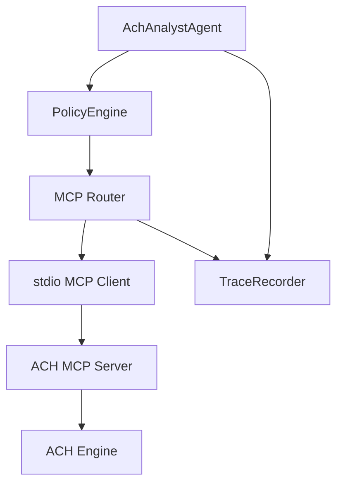

# WARDEN ACH MCP 분리 개발계획

## 배경

현재 ACH는 MCP 서버가 아니라 에이전트 코어 내부의 local deterministic module이다.

현재 경로:

```text
warden CLI/server
-> runtime MCP-style router
-> run_warden_team
-> AchAnalystAgent
-> createAchLocalTool()
-> openCaseFromFrame/addEvidenceFromBundles/assessFromBundles/buildAchAnalysisResult
```

문제:

- `src/agent/agents/ach-analyst.ts`가 `src/agent/tools/ach-local.ts`를 직접 import한다.
- trace에는 `server: "local-ach"`로 남지만 실제 MCP process/server boundary는 없다.
- ACH가 WARDEN core에 합산되어 있어 capability 분리, 독립 배포, 별도 regression, 외부 감사 경계가 약하다.

## 목표

ACH를 WARDEN core에서 분리해 **별도 stdio MCP capability server**로 실행한다.

목표 경로:

```text
warden CLI/server
-> runtime/team orchestrator
-> policy gate
-> MCP router/client
-> ACH MCP server
-> deterministic ACH engine
```

핵심 원칙:

- WARDEN core는 orchestration, policy, approval, trace만 담당한다.
- ACH 계산 권위는 MCP capability server가 가진다.
- 모델은 ACH tool을 직접 실행하지 못한다.
- 모든 ACH tool call은 policy decision과 MCP result trace를 남긴다.

## 범위

포함:

- ACH stdio MCP server
- ACH tool schema와 dispatcher
- `ach_analyst`의 direct local call 제거
- policy/MCP route를 통한 ACH tool invocation
- 기존 verifier/regression 유지
- fail-closed MCP timeout/malformed response regression

제외:

- 원격 네트워크 MCP 배포
- 다중 tenant auth
- ACH 알고리즘 변경
- live data ingestion

## 현재 코드 기준

| 영역 | 현재 파일 | 상태 |
|---|---|---|
| ACH engine | `src/agent/tools/ach-local.ts` | core 내부 deterministic module |
| ACH caller | `src/agent/agents/ach-analyst.ts` | 직접 함수 호출 |
| MCP fixture | `fixtures/mcp/warden-stdio-fixture.mjs` | echo fixture, ACH 아님 |
| MCP client | `src/agent/mcp/stdio-client.ts` | stdio tool call 지원 |
| MCP router | `src/agent/mcp/router.ts` | allowlist/policy 이후 tool invoke |

## 대상 구조



## 생성 파일

| 파일 | 목적 |
|---|---|
| `src/mcp/ach/types.ts` | ACH MCP request/response payload type |
| `src/mcp/ach/tools.ts` | `open_case`, `add_evidence`, `assess`, `rank_hypotheses` dispatcher |
| `src/mcp/ach/stdio-server.ts` | newline JSON-RPC style stdio MCP server entrypoint |
| `src/agent/mcp/ach-client.ts` | AchAnalyst가 사용할 ACH MCP invocation wrapper |
| `fixtures/mcp/ach-server.json` | local ACH MCP server config |
| `demo/run-warden-ach-mcp-regression.ts` | ACH MCP extraction regression |

## 수정 파일

| 파일 | 수정 내용 |
|---|---|
| `src/agent/agents/ach-analyst.ts` | `createAchLocalTool()` direct call 제거, ACH MCP client 사용 |
| `src/agent/team-runner.ts` | AgentContext에 MCP router 또는 tool invoker 전달 |
| `src/agent/types.ts` | `AgentToolInvoker`, `McpToolInvocation` 타입 추가 |
| `src/agent/verifiers.ts` | ACH tool trace ref가 MCP 경유여도 검증되도록 보정 |
| `src/runtime/loop.ts` | team runner에 ACH MCP config 주입 옵션 추가 |
| `package.json` | `demo:warden:ach-mcp` script 추가 |

## MCP Tool API

### `open_case`

입력:

```ts
type OpenCaseInput = {
  frame: CaseFrame;
};
```

출력:

```ts
type OpenCaseOutput = {
  caseRecord: AchCaseRecord;
};
```

### `add_evidence`

입력:

```ts
type AddEvidenceInput = {
  caseRecord: AchCaseRecord;
  bundles: EvidenceBundle[];
};
```

출력:

```ts
type AddEvidenceOutput = {
  caseRecord: AchCaseRecord;
};
```

### `assess`

입력:

```ts
type AssessInput = {
  caseRecord: AchCaseRecord;
  bundles: EvidenceBundle[];
};
```

출력:

```ts
type AssessOutput = {
  caseRecord: AchCaseRecord;
};
```

### `rank_hypotheses`

입력:

```ts
type RankHypothesesInput = {
  caseRecord: AchCaseRecord;
  evidenceBundleIds: string[];
};
```

출력:

```ts
type RankHypothesesOutput = {
  result: AchAnalysisResult;
};
```

## 핵심 함수

- `createAchMcpServer()`
- `dispatchAchToolCall(name, input)`
- `validateAchToolInput(name, input)`
- `createAchMcpClient(config)`
- `invokeAchTool<TInput, TOutput>(toolName, input, context)`
- `buildAchToolPlan(toolName, input, risk)`
- `assertAchMcpAuthority(trace, result)`

## 구현 순서

### 1. ACH MCP server scaffold

- `src/mcp/ach/stdio-server.ts` 생성
- 기존 `ach-local.ts` engine은 우선 재사용
- JSON-RPC request parsing, response validation, error response 구현
- malformed input은 fail-closed

### 2. ACH tool schema

- tool별 input parser 구현
- `CaseFrame`, `EvidenceBundle[]`, `AchCaseRecord` 최소 runtime validation 추가
- `risk` metadata 정의: `open_case`, `add_evidence`, `assess`는 WRITE, `rank_hypotheses`는 READ

### 3. AgentContext tool invoker

- `AgentContext`에 `tools.invoke(plan, input)` 또는 `mcpRouter` 추가
- P0 테스트에서는 local stdio ACH server를 자동 기동하거나 fixture config를 주입
- direct import 금지

### 4. AchAnalystAgent 교체

- `createAchLocalTool()` 제거
- `open_case -> add_evidence -> assess -> rank_hypotheses`를 MCP 호출로 실행
- 각 호출 전 policy decision 기록
- MCP result payload를 trace에 기록

### 5. Verifier 보정

- 기존 verifier가 `tool_call` trace를 보고 `open_case`, `add_evidence`, `assess`를 확인한다.
- MCP 경유 후에도 동일 tool ref 또는 canonical ref가 남도록 유지
- missing MCP result, observationTrusted=false 처리 정책 확정

### 6. Regression

- normal supply-chain regression 통과
- ACH MCP server timeout fail-closed
- malformed MCP response fail-closed
- unknown ACH tool deny
- direct ACH local import 금지 grep test

## 체크리스트

### P10.5.0 Server

- [x] `src/mcp/ach/stdio-server.ts` 생성
- [x] `open_case` 구현
- [x] `add_evidence` 구현
- [x] `assess` 구현
- [x] `rank_hypotheses` 구현
- [x] malformed request fail-closed

### P10.5.1 Client/Router

- [x] `fixtures/mcp/ach-server.json` 작성
- [x] ACH MCP allowlist 적용
- [x] `AchAnalystAgent`가 MCP client를 통해 호출
- [x] direct `createAchLocalTool()` import 제거
- [x] policy decision 유지

### P10.5.2 Trace/Verifier

- [x] MCP tool call trace 기록
- [x] MCP tool result trace 기록
- [x] ACH matrix completeness 검증 유지
- [x] verifier가 MCP 경유 tool refs를 인식

### P10.5.3 Regression

- [x] `demo:warden:ach-mcp` 추가
- [x] 기존 `demo:warden:regression` 통과
- [x] timeout/malformed MCP fail-closed
- [x] direct local ACH call 금지 regression
- [x] `npm test`에 포함

## 구현 결과 (2026-06-15)

- ACH tool boundary를 `src/mcp/ach/*`와 `src/agent/mcp/ach-client.ts`로 분리했다.
- `AchAnalystAgent`는 더 이상 `createAchLocalTool()`을 직접 import하지 않고 stdio MCP client wrapper를 통해 `open_case`, `add_evidence`, `assess`, `rank_hypotheses`를 호출한다.
- `demo/run-warden-ach-mcp-regression.ts`가 direct local ACH call 금지, timeout/malformed fail-closed, 기존 team workflow 통과를 검증한다.
- `npm test`에 `demo:warden:ach-mcp`가 포함되었다.

## 완료 기준

- `src/agent/agents/ach-analyst.ts`에서 `src/agent/tools/ach-local.ts` direct import가 사라진다.
- ACH 결과는 MCP tool response에서만 온다.
- 기존 ACH regression 결과가 동일하게 유지된다.
- MCP failure가 silent fallback으로 core local ACH를 실행하지 않는다.

## 위험과 판단

- MCP process boundary를 넣으면 테스트가 느려질 수 있다.
- 초기에 stdio server를 stateless로 유지해야 재현성이 좋다.
- production MCP로 확장하기 전까지는 local stdio server만 허용한다.
