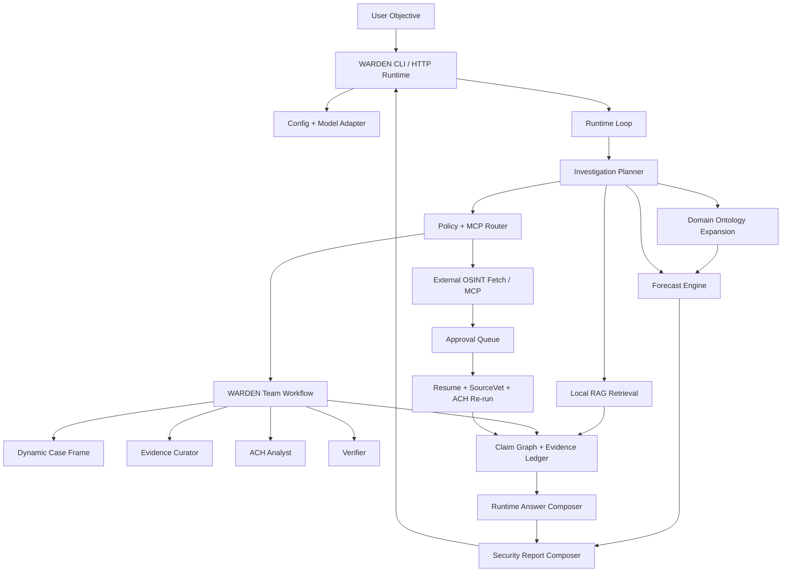

# WARDEN 현재 개발내역 아키텍처 기능평가

## 1. 요약

현재 WARDEN은 단순한 정적 리포트 생성기가 아니라, CLI/HTTP 런타임에서 자연어 objective를 받아 분석계획, 도메인 확장, 로컬 RAG, ACH, SourceVet, forecast, 보고서 생성을 통제 흐름으로 엮는 에이전트 런타임으로 발전했다.

다만 아직 "실전형 안보/지정학/공급망 미래예측 에이전트"라고 부르기에는 웹 discovery 품질, 로컬 corpus ingest, MCP 경계 통일, 한국어 보고서 문체, forecast calibration이 부족하다. 현재 수준은 **오프라인/fixture 기반 분석 프로토타입에서 제품형 분석 런타임으로 넘어가는 중간 단계**다.

현재 검증 상태:

- `npm test` 전체 통과
- `warden run "중국의 대만 침공 가능성"`에서 분석계획, 온톨로지, RAG, claim graph, forecast, 보안분석 보고서 출력 확인
- 승인 전 외부 호출 차단과 y/n 승인 UX 동작
- Codex OAuth 모델 provider 경로 유지

## 2. 전체 아키텍처

핵심 설계 원칙:

1. LLM은 실행 권한이 아니라 proposal 역할만 한다.
2. 정책, 승인, MCP 라우터, ACH, SourceVet, verifier가 권위 계층을 만든다.
3. 외부 호출은 사람 승인 전까지 차단한다.
4. 분석 산출물은 런타임 outputs에 구조화해 남긴다.
5. 보고서는 사실, 추론, 예측, 불확실성, 수집 공백을 분리한다.

## 3. 주요 실행 흐름

1. 사용자가 `warden` 또는 `warden run "<objective>"`로 질문한다.
2. `src/runtime/loop.ts`가 run을 만들고 상태를 `queued -> running`으로 전환한다.
3. 모델 provider가 mock/codex/openai-compatible 중 하나로 설정된다.
4. `buildInvestigationPlan()`이 질문별 분석계획을 만든다.
5. `buildRuntimeAnalysisProducts()`가 도메인 확장, RAG, claim graph, forecast 산출물을 만든다.
6. runtime planner가 다음 tool plan을 선택한다.
7. policy/MCP router가 `run_warden_team` 또는 `external_osint_fetch`를 통제 실행한다.
8. 팀 실행 결과로 dynamic case frame, evidence bundle, ACH 결과가 생성된다.
9. 외부 OSINT는 승인 대기 상태가 되고, 승인 시 SourceVet 검토 후 ACH를 재실행한다.
10. `composeDeterministicAnswer()`와 `composeSecurityReport()`가 사용자 답변과 보안분석 보고서를 만든다.

## 4. 기능별 개발 내역

### 4.1 CLI Runtime UX

주요 파일:

- `src/cli/warden.ts`
- `bin/warden.mjs`
- `src/runtime/server.ts`
- `src/runtime/start-server.ts`

구현 상태:

- `warden`, `warden run`, `warden server` entrypoint 제공
- Claude/Gemini 스타일의 터미널 패널 UI 적용
- 한국어 런타임 로그 출력
- 승인 대기 시 `예(y) / 아니오(n)` 질문
- `/runs`, `/approve`, `/reject`, `/server`, `/help`, `/exit` 지원
- 실행 결과에 답변, 보안분석 보고서, 분석 산출물 요약 출력

평가:

- 체감 UX는 이전보다 크게 개선됐다.
- 내부 단계가 `[분석계획]`, `[온톨로지]`, `[RAG]`, `[도구]`, `[승인]`으로 드러나 레이턴시 체감이 줄었다.
- 아직 긴 보고서 출력에서 영어 템플릿이 섞이는 문제가 있다.

### 4.2 Model Adapter and Proposal Boundary

주요 파일:

- `src/agent/model-adapter.ts`
- `src/agent/models/provider.ts`
- `src/agent/models/codex-cli.ts`
- `src/agent/models/mock-model.ts`
- `src/agent/models/openai-compatible.ts`

구현 상태:

- mock provider 기반 offline-first regression 유지
- Codex OAuth 기반 모델 proposal 경로 유지
- 모델 응답은 planner/briefing proposal로만 사용
- tool 실행은 policy/router가 최종 결정

평가:

- "LLM을 쓰되 LLM을 직접 믿지 않는다"는 제품 철학이 잘 유지된다.
- 다만 investigation plan에서 model proposal을 얼마나 적극적으로 활용할지, 실패 시 fallback 품질을 어떻게 높일지는 추가 개선 필요.

### 4.3 Runtime Loop and State

주요 파일:

- `src/runtime/loop.ts`
- `src/runtime/types.ts`
- `src/runtime/storage.ts`
- `src/runtime/memory-runtime-store.ts`
- `src/runtime/jsonl-runtime-store.ts`
- `src/runtime/rehydrate.ts`

구현 상태:

- run lifecycle 관리
- model proposal 기록
- tool result 기록
- approvals 기록
- runtime outputs에 다음 구조화 산출물 포함:
  - `investigationPlan`
  - `domainExpansion`
  - `ragContext`
  - `claimGraph`
  - `evidenceLedger`
  - `forecast`
  - `answer`
  - `securityReport`
- JSONL persistence와 rehydrate 경로 존재

평가:

- 런타임 중심 설계는 안정적이다.
- 산출물이 많아진 만큼 outputs schema가 커지고 있어, 이후에는 report/analysis state를 하위 객체로 계층화하는 것이 좋다.

### 4.4 Dynamic Investigation Planner

주요 파일:

- `src/runtime/investigation-plan-schema.ts`
- `src/runtime/investigation-planner.ts`
- `demo/run-warden-investigation-plan-regression.ts`

구현 상태:

- 질문별 domain/scenario/matchedSignals 분류
- 대만 침공, 동북아 공급망, 제재/수출통제, generic security fallback 제공
- hypothesis/searchPlan 생성
- schema validation과 fallback warning 처리

평가:

- 기존 고정 공급망 가설 문제는 해결됐다.
- region/actor/time horizon이 아직 풍부한 구조로 분리되지 않는다.
- searchPlan과 RAG plan이 완전히 별도 스키마로 분리되지는 않았다.

### 4.5 Dynamic Case Frame and ACH Integration

주요 파일:

- `src/agent/dynamic-case-frame.ts`
- `src/agent/evidence-scoring.ts`
- `src/agent/agents/case-framer.ts`
- `src/agent/agents/evidence-curator.ts`
- `src/agent/team-runner.ts`
- `src/runtime/resume-evidence.ts`

구현 상태:

- `investigationPlan` 우선 case frame 생성
- legacy `createSupplyChainCaseFrame()`는 fallback/fixture 경로로 격리
- `KnowledgeUnit[]`를 현재 hypotheses에 맞는 evidence bundle로 변환
- 승인 후 fetch evidence도 SourceVet 이후 dynamic ACH frame에 매핑
- ACH verdict는 현재 `C/I/N` 기반

평가:

- 사용자가 지적한 "질문과 무관한 공급망 fixture 가설" 문제를 실질적으로 해소했다.
- `NA` verdict 타입과 analyst-confirmed mapping은 아직 없다.
- 자동 verdict mapping은 규칙 기반이라 섬세한 의미 판정은 부족하다.

### 4.6 ACH and MCP

주요 파일:

- `src/mcp/ach/tools.ts`
- `src/mcp/ach/types.ts`
- `src/mcp/ach/stdio-server.ts`
- `src/agent/tools/ach-local.ts`

구현 상태:

- ACH case extraction/rank_hypotheses 경로
- dynamic domain 허용
- RFI 문구가 대만/공급망 등 scenario별로 달라짐
- MCP regression 포함

평가:

- ACH를 별도 MCP로 빼기 위한 기반은 있다.
- 다만 runtime 기본 경로는 아직 `runTeamWorkflow()` 내부 도구 실행에 많이 의존한다.

### 4.7 SourceVet and Approval Resume

주요 파일:

- `src/agent/agents/sourcevet-reviewer.ts`
- `src/agent/sourcevet-types.ts`
- `src/runtime/resume.ts`
- `src/runtime/resume-evidence.ts`
- `src/runtime/approval-actions.ts`

구현 상태:

- 승인 전 외부 호출 차단
- 승인 후 fetch evidence 수집
- SourceVet 검토 후 evidence promotion
- critical/high flag source는 ACH 승격 차단
- survivor delta 계산
- resume 실패 상태 처리

평가:

- 보안/통제 설계가 프로젝트의 강점이다.
- SourceVet이 RAG 자료까지 동일하게 검증하는 경로는 아직 부족하다.

### 4.8 OSINT and Web Discovery

주요 파일:

- `src/mcp/osint/tools.ts`
- `src/connectors/osint/search.ts`
- `src/connectors/osint/discovery.ts`
- `src/connectors/osint/html-scraper.ts`
- `src/connectors/osint/source-registry.ts`
- `src/connectors/osint/robots.ts`
- `src/connectors/osint/sitemap.ts`
- `src/connectors/osint/article-extractor.ts`
- `fixtures/osint/source-registry.json`

구현 상태:

- `search_news`, `discover_news`, `scrape_news` MCP 경로
- live OSINT opt-in
- allowlist/approval guard
- provider telemetry
- source registry, robots parser, sitemap extraction, article extraction foundation

평가:

- "Brave Search만 의존하지 않는 직접 discovery" 방향의 기반은 마련됐다.
- 아직 RSS/GDELT/site registry 조합이 제품 기본 경로로 충분히 강하지 않다.
- live 웹 수집 결과의 품질, 중복 제거, 최신성 ranking은 더 필요하다.

### 4.9 Local RAG

주요 파일:

- `src/connectors/rag/corpus.ts`
- `src/connectors/rag/retrieval.ts`
- `src/connectors/rag/types.ts`
- `src/mcp/rag/tools.ts`
- `src/mcp/rag/stdio-server.ts`
- `fixtures/rag/domain-corpus.json`

구현 상태:

- fixture-backed local corpus
- KnowledgeUnit normalization
- BM25-style retrieval
- tag/domain/region/topic 기반 retrieval
- MCP `retrieve_context`, `summarize_corpus`
- runtime `analysis-products.ts`에서 objective + plan + ontology terms로 RAG query 구성

평가:

- RAG가 answer/report/claim graph까지 연결된 것은 큰 진전이다.
- 아직 `Projects/02010_desk_defense`, Obsidian, PDF/Markdown/TXT ingestion은 연결되지 않았다.
- 현재 RAG는 "실제 지식 베이스"라기보다 domain fixture 기반이다.

### 4.10 Domain Ontology and Scenario Library

주요 파일:

- `src/domain/types.ts`
- `src/domain/ontology.ts`
- `src/domain/scenarios.ts`
- `src/domain/query-expansion.ts`
- `fixtures/domain/security-ontology.json`
- `fixtures/domain/scenario-library.json`

구현 상태:

- actors, regions, sectors, signals, risks, sourceHints ontology
- scenario templates:
  - Taiwan Strait blockade/quarantine
  - Korea supply-chain stress
  - sanctions/export-controls cascade
  - maritime chokepoint disruption
- 한국어 `중국의 대만 침공 가능성` scenario matching 회귀 추가
- search/RAG/forecast source hint 확장

평가:

- 안보/지정학/공급망 특화의 핵심 기반이다.
- 도메인 지식이 JSON fixture에 집중되어 있어 관리 가능하다.
- 향후 지역/산업별 템플릿을 늘리면 에이전트 정체성이 강해진다.

### 4.11 Claim Graph and Evidence Ledger

주요 파일:

- `src/agent/claim-graph/index.ts`
- `src/agent/evidence-ledger.ts`
- `demo/run-warden-claim-graph-regression.ts`

구현 상태:

- KnowledgeUnit.claims 기반 claim graph 생성
- claim sanitizer
- same-claim deduplication
- polarity detection
- contradiction edge
- citation/source lineage edge
- evidence ledger entries

평가:

- 최종 판단을 claim/source 단위로 추적하기 위한 기반이 생겼다.
- 아직 LLM 기반 claim extraction schema와 보고서 citation renderer는 없다.
- evidence ledger persistence도 다음 공정이다.

### 4.12 Forecast Engine

주요 파일:

- `src/forecast/types.ts`
- `src/forecast/engine.ts`
- `src/mcp/forecast/tools.ts`
- `src/runtime/analysis-products.ts`
- `demo/run-warden-forecast-regression.ts`

구현 상태:

- forecast question/horizon schema
- base rate estimate
- indicator scoring
- bounded probability adjustment
- confidence band
- scenario set
- watchlist
- runtime security report 연결

평가:

- "가능/불가능" 답변에서 "기간/확률범위/관찰지표" 답변으로 전환됐다.
- 현재 확률은 calibration된 모델이 아니라 heuristic estimate다.
- live evidence observation과 forecast update loop가 아직 약하다.

### 4.13 Report Composer

주요 파일:

- `src/runtime/report-schema.ts`
- `src/runtime/report-composer.ts`
- `src/runtime/answer.ts`
- `demo/run-warden-security-report-regression.ts`

구현 상태:

- `RuntimeAnswer`와 `SecurityReport` 분리
- facts/analysis/forecast/uncertainty/collectionGaps/watchIndicators 분리
- confidence rationale
- approval pending이면 live evidence 미사용 명시
- forecast point/range/scenario 출력
- RAG, claim graph, evidence ledger, authorityRefs 포함

평가:

- 사용자가 원한 "실제 답변"에 가장 가까운 레이어다.
- 영어 hypothesis template이 그대로 노출되는 경우가 있어 한국어 문체 정리가 필요하다.
- 구조화 JSON 출력은 가능하지만, human-readable CLI formatting은 더 다듬을 수 있다.

### 4.14 MCP Boundary Hardening

주요 파일:

- `src/runtime/mcp-orchestrator.ts`
- `src/runtime/mcp-result-validation.ts`
- `demo/run-warden-mcp-boundary-full-regression.ts`

구현 상태:

- MCP ToolResult envelope validation
- OSINT/RAG/ACH/forecast output validator
- malformed result 차단
- MCP error를 collection gap warning으로 변환

평가:

- MCP 경계 검증 foundation은 좋다.
- runtime 기본 경로가 아직 모든 도구를 orchestrator를 통해서만 호출하지는 않는다.
- P27의 다음 작업은 "foundation"을 "default path"로 승격하는 것이다.

### 4.15 Testing and Regression

주요 파일:

- `package.json`
- `demo/run-warden-*-regression.ts`
- `evals/*.json`

구현 상태:

- build/import check
- CLI/runtime/server regression
- planner/investigation/dynamic case frame/security report regression
- RAG/OSINT source registry/claim graph/forecast/domain ontology/MCP boundary regression
- live OSINT guard/resume/sourcevet regression
- domain eval fixture foundation

평가:

- 회귀 테스트 폭은 상당히 넓다.
- 다만 평가셋은 아직 작고, 답변 품질 자동 점수화는 domain ontology golden id 중심이다.
- 실제 OSINT 품질, 예측 calibration, 한국어 답변 품질 평가는 별도 확장이 필요하다.

## 5. 현재 제품 수준 평가

| 평가축 | 점수 | 판단 |
|---|---:|---|
| 런타임 아키텍처 | 8.0 / 10 | policy, approval, model boundary, outputs 구조가 견고하다. |
| 보안/통제성 | 8.5 / 10 | 외부 호출 승인, SourceVet, authorityRefs, guard regression이 강점이다. |
| CLI 사용성 | 7.5 / 10 | 실행/승인/로그 UX는 좋다. 긴 보고서 가독성은 개선 여지. |
| 도메인 특화성 | 7.2 / 10 | ontology/scenario/forecast가 붙었다. 템플릿 확장이 필요하다. |
| 분석 품질 | 6.8 / 10 | 질문별 ACH/forecast/RAG가 가능하나 evidence mapping은 초기 규칙이다. |
| live OSINT | 5.8 / 10 | 경로는 있으나 discovery 품질과 기본 연결이 아직 부족하다. |
| RAG | 5.5 / 10 | 구조는 있으나 실제 corpus ingest가 부족하다. |
| Forecast | 6.3 / 10 | 산출물 형식은 좋지만 확률은 heuristic이다. |
| 테스트 성숙도 | 8.0 / 10 | regression 폭이 넓고 offline-first가 좋다. 평가셋은 더 필요. |
| 제품 완성도 | 6.8 / 10 | 실사용 가능한 prototype. 고신뢰 분석 제품까지는 추가 공정 필요. |

종합 점수: **7.1 / 10**

현재 WARDEN은 "에이전트 서버가 실행되고 LLM proposal과 MCP/policy/ACH/SourceVet/forecast를 엮어 답변하는 제품 골격"까지 왔다. 사용자가 원하는 안보/지정학/공급망 미래예측 에이전트의 핵심 구조는 들어갔지만, 실제 웹/로컬 자료를 충분히 수집하고 검증해 신뢰할 수 있는 분석으로 만드는 데이터 공정은 아직 미완성이다.

## 6. 강점

- LLM을 직접 실행 주체로 두지 않는 통제 구조
- 외부 호출 승인과 SourceVet 기반 evidence promotion
- 질문별 investigation plan과 dynamic ACH frame
- RAG, ontology, claim graph, forecast, report composer가 하나의 runtime outputs로 연결
- CLI에서 내부 진행 상태가 잘 드러남
- regression suite가 넓어 기능 회귀를 잡기 좋음

## 7. 약점과 리스크

- live OSINT가 아직 "충분한 답변 품질"을 보장하지 못한다.
- RAG corpus가 fixture 수준이라 기존 프로젝트 자료를 충분히 활용하지 못한다.
- forecast probability는 heuristic이라 calibration된 예측으로 과신하면 안 된다.
- ACH verdict mapping이 규칙 기반이라 복잡한 문장 의미를 놓칠 수 있다.
- 보고서에 영어 template 문장이 남아 한국어 사용자 경험을 해친다.
- MCP boundary foundation은 있으나 runtime 전체 기본 경로가 아직 완전한 MCP orchestrator 중심은 아니다.

## 8. 다음 개발 우선순위

### 8.1 실제 지식 기반 강화

- `Projects/02010_desk_defense` 자료 ingest
- Obsidian project notes ingest
- PDF/Markdown/TXT parser를 RAG corpus로 연결
- RAG 결과에도 SourceVet-like quality check 적용

### 8.2 Web Discovery 품질 개선

- P22 source registry를 runtime discovery 기본 경로에 연결
- RSS/GDELT/official source/sitemap/site search 조합 강화
- Investing.com, 해운, 기업 IR, 정부 공시 등 source family별 extractor 추가
- DNS private IP 차단과 SSRF 방어 강화

### 8.3 MCP 경계 통일

- RAG/forecast/ACH 기본 실행도 `mcp-orchestrator` 경유
- connector 직접 호출을 줄이고 MCP result validation을 강제
- MCP error를 report collection gap으로 일관 반영

### 8.4 한국어 분석 보고서 품질

- hypothesis/searchPlan/report template 한국어화
- 긴 ACH survivor 목록을 요약형 판단문으로 변환
- `핵심 판단`, `근거`, `예측`, `수집 공백` 출력 길이 제어

### 8.5 Forecast 고도화

- observed indicator와 live evidence 연결
- reference class corpus 확장
- probability update reason을 더 설명 가능하게 개선
- baseline/escalation/de-escalation scenario taxonomy 보강

### 8.6 평가체계 확장

- P28 golden case 20개 이상 작성
- 대만해협, 한반도, 제재/수출통제, 반도체, 해운/에너지 케이스 분리
- 답변 품질, citation hallucination, uncertainty discipline 자동 점수화

## 9. 결론

WARDEN은 더 이상 "정적 HTML 리포트 생성" 수준이 아니다. 현재는 터미널에서 실행되는 통제형 분석 런타임이며, 자연어 objective를 받아 LLM proposal, 도메인 온톨로지, RAG, ACH, SourceVet, forecast, report composer를 통합해 답변한다.

하지만 고신뢰 안보/지정학/공급망 분석 에이전트로 인정받으려면 다음 단계가 중요하다. **실제 자료 수집과 RAG corpus 확장, MCP 경계 통일, 한국어 보고서 품질, forecast calibration**을 해결해야 한다. 이 네 가지가 보강되면 WARDEN은 "그럴듯한 답변을 하는 CLI"에서 "근거와 불확실성을 통제하는 전략분석 에이전트"로 올라갈 수 있다.
