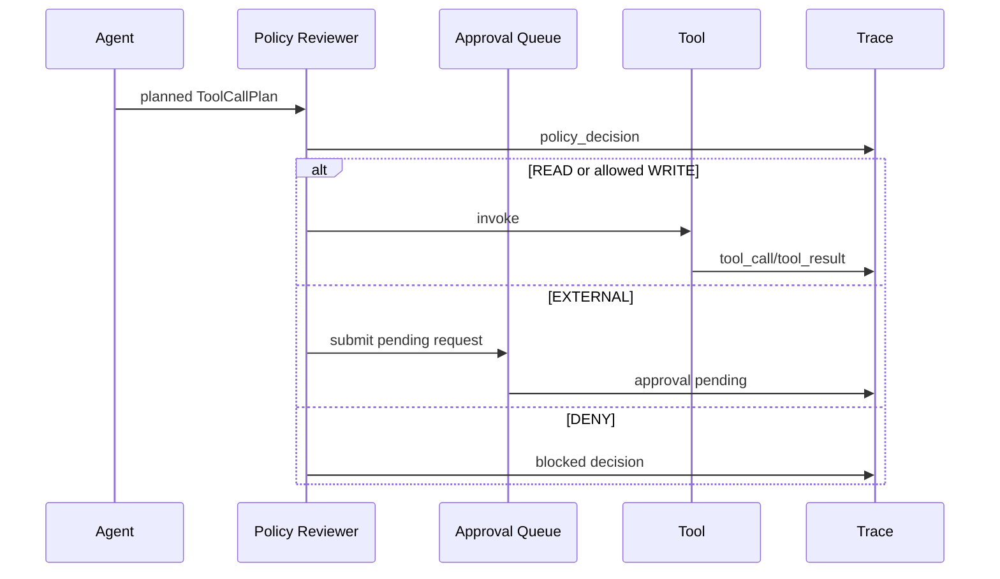
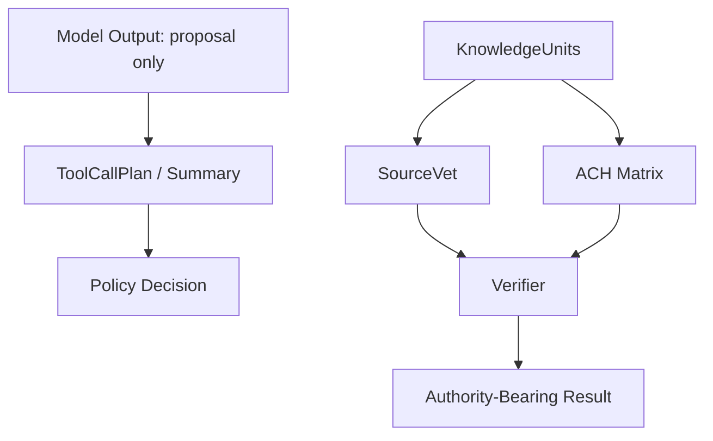
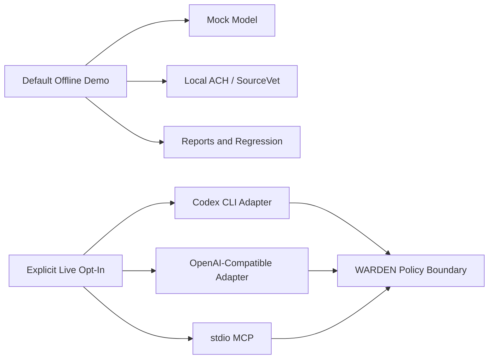

# WARDEN Architecture

## Control Plane

```mermaid
flowchart LR
  User["User Request"] --> Supervisor["Warden Supervisor"]
  Supervisor --> Case["Case Framer"]
  Case --> Evidence["Evidence Curator"]
  Evidence --> SourceVet["SourceVet Reviewer"]
  SourceVet --> Policy["Policy Reviewer"]
  Policy --> ACH["ACH Analyst"]
  ACH --> Verifier["Verifier"]
  Verifier --> Briefing["Briefing Agent"]
  Briefing --> Report["HTML Audit Report"]
```

## Policy-Gated Tool Call

```mermaid
sequenceDiagram
  participant Agent
  participant Policy as Policy Reviewer
  participant Approval as Approval Queue
  participant Tool
  participant Trace
  Agent->>Policy: planned ToolCallPlan
  Policy->>Trace: policy_decision
  alt READ or allowed WRITE
    Policy->>Tool: invoke
    Tool->>Trace: tool_call/tool_result
  else EXTERNAL
    Policy->>Approval: submit pending request
    Approval->>Trace: approval pending
  else DENY
    Policy->>Trace: blocked decision
  end
```

## Deterministic Authority

```mermaid
flowchart TD
  Model["Model Output: proposal only"] --> Plan["ToolCallPlan / Summary"]
  Plan --> Policy["Policy Decision"]
  Evidence["KnowledgeUnits"] --> SourceVet["SourceVet"]
  Evidence --> ACH["ACH Matrix"]
  SourceVet --> Verifier["Verifier"]
  ACH --> Verifier
  Verifier --> Authority["Authority-Bearing Result"]
```

## Local And Live Boundary

```mermaid
flowchart LR
  Offline["Default Offline Demo"] --> Mock["Mock Model"]
  Offline --> LocalTools["Local ACH / SourceVet"]
  Offline --> Reports["Reports and Regression"]
  Live["Explicit Live Opt-In"] --> Codex["Codex CLI Adapter"]
  Live --> OpenAI["OpenAI-Compatible Adapter"]
  Live --> MCP["stdio MCP"]
  Codex --> Policy["WARDEN Policy Boundary"]
  OpenAI --> Policy
  MCP --> Policy
```
